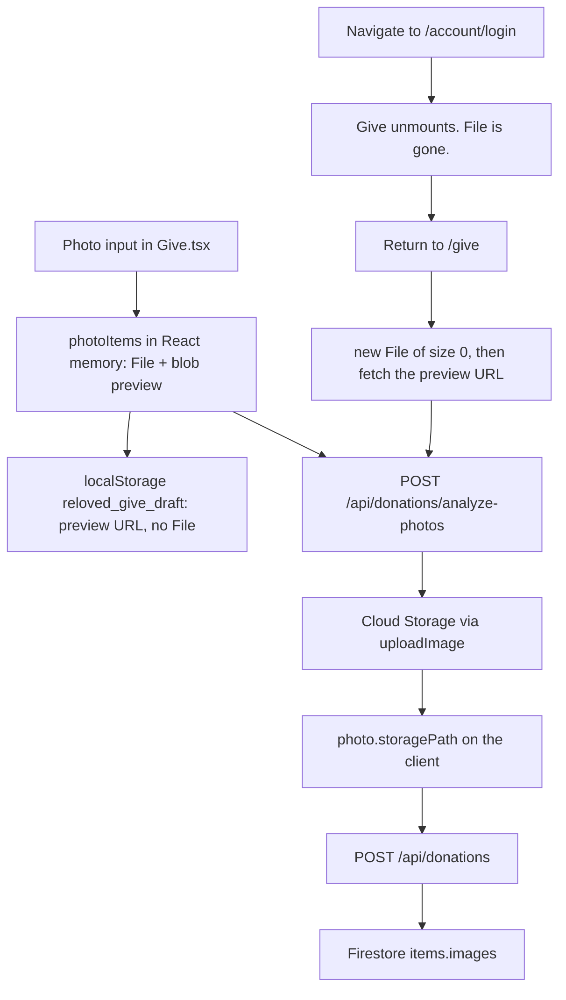

# Drop item image audit

Date: 28 Sep 2026. Code was read. Nothing was changed. This was not reproduced in a browser.

The Drop flow is `frontend/src/pages/public/Give.tsx` (`/give`). There is no separate drop-zone component. Images go to Cloud Storage through `POST /api/donations/analyze-photos` and `POST /api/donations`. Firestore stores `items.images[].storagePath`. There is no S3 and no presigned URL.

## 1. Executive summary

Two confirmed ways a photo is lost, plus one high-confidence way a single item’s extra photos collapse into the first photo.

- **CONFIRMED.** A multiple-item submit sends the same `idempotencyKey` on every item. The server treats the second and later calls as a replay of the first item and does not save those photos. The screen still says the drop succeeded.
- **CONFIRMED.** The selected `File` lives only in React memory. Login navigates away from `/give`, so that `File` is destroyed. The draft in `localStorage` keeps a preview URL, not the file. If that URL is a dead `blob:` URL, or `localStorage` rejects the data URL, the photo cannot be rebuilt. The existing gift has no “add photo” control, so the user drops again.
- **HIGH CONFIDENCE.** In single-item mode, several camera photos can share one filename (`photo-<same millisecond>.jpg`). The analyze result merge keeps the first match. Later photos are uploaded, then overwritten in client state, so the item is saved with the first image only.

The server refuses to create an item when `images.length === 0`. A row that exists was written with at least one storage path. A missing picture after that is either a later item that was never written, a path that does not render, or a photo that never made it into that item’s `images` array.

## 2. Current architecture

Upload implementations in the repo:

| Place | Used by Drop? |
|---|---|
| `Give.tsx` file inputs + `FormData` field `photos` | Yes. This is the Drop flow. |
| `AdminBulkUpload.tsx` | No. Admin only. |
| `ClaimDetail.tsx` `FormData` | No. Claim chat/attachment, not Drop. |
| `wallProductImage.ts` `createObjectURL` | No. Wall display trim only. |

There is no drag-and-drop handler on Drop. Selection is `<input type="file">`.

## 3. Single item flow

`uploadMode === "single"`. Every photo gets `groupId: 0`. Limit 5.

Continue runs AI/store, then details, then review, then one `POST /api/donations`. All `storagePath` values go in `photoStoragePaths`. Files that still have no path are appended as multipart `photos`.

One item, one request, one new `idempotencyKey`. This path does not hit the bulk replay bug.

## 4. Multiple item flow

`uploadMode === "bulk"`. Each new photo starts as its own `groupId` (limit 30). The user can regroup angles onto one chip.

Submit treats it as bulk only when `uploadMode === "bulk"` and there are 2 or more groups. Then `handleSubmit` loops and calls `postDonation` once per group.

`idempotencyKey` is created once, before the loop, and copied into every call (`Give.tsx` around the payload object, then `{ ...payload, ... }` inside the loop).

## 5. Image upload flow

1. `handlePhotoUpload` compresses the file and stores `{ file, previewUrl: blob URL, groupId }` in `photoItems`.
2. `analyzePhotos` posts chunks of 3 to `POST /api/donations/analyze-photos?mode=`.
3. Modes: `catalog` (titles), `cutout` (studio), `store` (upload only), `full` (legacy).
4. A successful result sets `storagePath` to the Storage URL.
5. `ensurePhotosReadyForSubmit` waits for an in-flight analyze, then runs `mode=store` for any photo that still has a real `File` and no `storagePath`.
6. `POST /api/donations` prefers those paths. Leftover files are multipart.

`analyze-photos` is also rate-limited in this branch (10 per 10 minutes per process). A burst of chunks can return 429. Those chunks are marked failed and the photo stays without `storagePath`. Submit then tries `store` again, or refuses if the `File` is already gone.

## 6. Login flow

Guest steps are Photo → Details → Login → Review → Post.

Step 8 and a submit without a token call `persistGiveDraft(..., { awaitingLogin: true })` and `navigate("/account/login?redirect=/give")`. `Give` unmounts.

After login, `/give` mounts again. The restore effect reads `reloved_give_draft`. It does not get the original `File`. It builds `new File([], fileName)` and then `hydratePhotoFile` fetches `previewUrl`.

**Where the image lives immediately before login:** in `photoItems` as a `File`, and in the draft as `previewUrl` (data URL if the blob converted, otherwise the `blob:` URL or a Storage URL if analyze already finished).

**Where the app looks after login:** `localStorage` / `sessionStorage` key `reloved_give_draft`, then `fetch(previewUrl)`. It does not look in Storage unless `storagePath` was saved. It does not look at a draft item row. There is no draft item in Firestore.

If `storagePath` was saved before login, submit can post that path without the `File`. If it was not, and the preview cannot be fetched, the photo is gone.

Logout removes `reloved_give_draft` (`donorSession.ts`).

## 7. Frontend state lifecycle

| State | Survives login? |
|---|---|
| `photoItems[].file` | No. Unmount destroys it. |
| `blob:` preview | No. The document that created it is gone. |
| data-URL preview in `localStorage` | Yes, until quota throws. The `catch` ignores the error. |
| `storagePath` in the draft | Yes. This is the durable copy. |
| `itemDrafts`, form fields, step | Yes, if the draft write succeeded. |

The 400ms persist effect writes the draft while the user edits. `persistGiveDraft` converts `blob:` to a data URL. On failure it stores the `blob:` string. That string is useless after navigation.

## 8. Backend / API

| Call | Method | Body | Success |
|---|---|---|---|
| `/api/donations/analyze-photos` | POST multipart | `photos`, `mode` | `{ results[].storagePath, suggestion }` |
| `/api/donations` | POST JSON or multipart | fields plus `photoStoragePaths`, optional `photos` | `{ reference, itemId, imageProcessingStatus }` |
| `/api/donations/polish-item-images` | POST JSON | `{ itemId }` | updates `items.images` |

Guest analyze can run before login. Donation create uses the session when `attachSessionIfPresent` has a donor token. Without a token the client does not post; it sends the user to login.

Idempotency (`publicWrite.ts`, donation handler): key is `sha256("donation|" + donorTarget + "|" + idempotencyKey)`. If that doc exists, the handler returns the first `itemId` and does not write again.

An item is not created when both the path list and the file upload list are empty. Partial upload failures still create the item if at least one image was stored.

## 9. Database / storage

Firestore `items.images[]`: `{ storagePath, imageType, sortOrder, bgRemoved }`. No separate media table. No foreign key. Ownership is `items.donorTarget` (session uid).

Storage is Firebase Cloud Storage (`lib/storage.ts`, bucket from `STORAGE_BUCKET`). `uploadImage` returns a URL stored as `storagePath`.

Polish downloads that URL, uploads a cutout, and replaces `storagePath` only when the cutout succeeds. On failure it keeps the original path. Polish is not the deletion path.

`GET /api/items?status=wall` drops items whose images have no `storagePath`. The donor dashboard still lists the item. Gift detail reads `images[0]` only.

## 10. Failure scenarios

| ID | Class | What happens |
|---|---|---|
| F1 | CONFIRMED | Bulk submit, same `idempotencyKey`. Item 2+ never written. UI records the first reference as success. |
| F2 | CONFIRMED | Login or refresh before `storagePath` exists, and the draft preview is a `blob:` URL or the data URL did not fit in `localStorage`. Restore makes an empty `File`. User is sent back to Photo. |
| F3 | HIGH CONFIDENCE | Single item, several photos, shared filename. Merge assigns the first photo’s `storagePath` to the later slots. Extra files sit in Storage with no item pointer. |
| F4 | POSSIBLE | Analyze chunk 429/500. Photo stays without a path. Submit can still save it if the `File` is alive. If the `File` was already replaced by an empty placeholder, it cannot. |
| F5 | POSSIBLE | Wall `ProductFillImage` shows `wsrv.nl` instead of the Storage URL. A proxy failure looks like a missing image while Firestore still has the path. |
| F6 | RULED OUT | Server creates a live item with an empty `images` array. That returns 400. |
| F7 | RULED OUT | Login changes `donorTarget` on an item that was already written. Donation is only posted with a session. |

## 11. Reproduction steps

Not run in a browser in this audit. Code path for F1:

1. Sign in.
2. Drop → Multiple items → add two photos (two groups).
3. Finish and submit.
4. Watch `POST /api/donations`. The second response is `200` with `idempotentReplay: true` and the first `itemId`.
5. Account shows one item. The second photo is not on it.

Code path for F2:

1. Sign out.
2. Add a photo. Do not wait for analyze to finish.
3. Continue through to login.
4. In devtools, if `reloved_give_draft` photo `previewUrl` starts with `blob:`, or the key is missing, sign in and return to `/give`.
5. The photo step asks you to add the photo again. No gift row exists yet.

## 12. Evidence

| Finding | File | What the code does |
|---|---|---|
| One key for every bulk item | `frontend/src/pages/public/Give.tsx` `handleSubmit` | `idempotencyKey` is set once on `payload`. The per-group body is `{ ...payload, photoStoragePaths }`. |
| Replay skips the write | `firebase-backend/functions/src/routes/publicWrite.ts` donation handler | Existing idempotency doc returns the previous `reference` and `itemId` and returns before `items.add`. |
| Empty file after restore | `Give.tsx` restore effect | `file: new File([], p.fileName \|\| "photo.jpg")`. Comment above `hydratePhotoFile` says drafts restore empty placeholders. |
| Draft has no `File` | `Give.tsx` `persistGiveDraft` | Saved fields are `previewUrl`, `storagePath`, `groupId`, `fileName`. `catch` ignores quota errors. |
| Login destroys memory | `Give.tsx` step 8 and `handleSubmit` | `navigate` to `/account/login?redirect=/give`. |
| Shared single-item filename | `Give.tsx` `handlePhotoUpload` | Single mode: `` `photo-${Date.now()}.jpg` `` with no index. Bulk mode includes `-${i}`. |
| First name wins | `Give.tsx` `analyzePhotos` merge | `nextPhotos.find` matches `groupId` plus `file.name`. First hit is reused for every photo with that name. |
| No photo on an existing gift | `GiveDetail.tsx` | Renders `images[0]`. No file input. |

## 13. Root cause

There is not one single bug.

The bug that matches “I submitted, the item exists, the other image is missing, dropping again fixes it” is **F1**. The second donation is swallowed as a replay. Re-dropping uses a new key, so the photo is written.

The bug that matches “I logged in and the photo I had selected is gone, so I must start the drop again” is **F2**. The `File` was never stored anywhere the new page can read.

F3 matches “one item, several photos, only the first picture remains” when the phone names every shot `image.jpg`.

## 14. Contributing factors

- Submit can look successful on an idempotent replay because the client only checks `reference`.
- `localStorage` failure is silent.
- `blob:` URLs are written when data-URL conversion throws.
- Analyze merge is by filename inside a group, not by index, except as a fallback when `find` misses.
- Gift and dashboard UIs show only `images[0]`, so a second angle is invisible even when it was saved.
- There is no attach-photo action on an existing drop.

## 15. Why dropping again fixes it

A new drop has a live `File`, a new `idempotencyKey`, and usually one item. `store` or the donation multipart upload writes a Storage URL, and `items.images` is set in the same create. Nothing has to resurrect the previous `File`.

## 16. Recommended fix

Do not rewrite upload.

1. Generate a new `idempotencyKey` inside the bulk loop, one per group.
2. Treat `idempotentReplay: true` as “this item was already saved”, not as “this photo was attached”.
3. Persist `storagePath` before navigating to login, or refuse to leave `/give` until `store` has returned a path. Do not rely on `blob:` after unmount.
4. If the draft cannot be saved, show that. Do not swallow the quota error.
5. In single-item naming, include the index the way bulk mode already does. Merge analyze results by chunk index first, and use filename only as a tie-break.

## 17. Minimal safe fix

Smallest change that stops lost items: **one idempotency key per group** in `handleSubmit`, and do not mark a replay as a newly uploaded photo.

Leave analyze, Storage, and the donation schema alone until that is verified.

The login/`File` loss needs a second small change: before `navigate` to login, `await` a `store` pass (or block with a visible error if `storagePath` is missing). That uses the upload path that already exists.

## 18. Long-term

Upload each photo to Storage as soon as it is picked, and keep only `storagePath` in the draft. The `File` is then optional. Bulk create should send item id ↔ path lists with per-item keys. An existing gift should accept another photo. That is a later change, not the first patch.

## 19. Required tests

- Two groups, one signed-in submit: two `items` docs, two different `idempotencyKey` values, each image on its own item.
- Second call with the same key returns the first item and does not append the second photo onto it.
- Single item, three files all named `image.jpg`: three distinct `storagePath` values on the one item.
- Signed-out pick → login → return: if `storagePath` was saved, review still shows it. If the draft write fails, the UI says the photo was not saved.

## 20. Regression matrix

Live run was not done. Actual is what the code does today.

| Scenario | Login | Items | Images | Expected | Actual in code |
|---|---|---|---|---|---|
| 1 | In | 1 | 1 | Persists | Path is stored on create. Should persist. |
| 2 | Out, then login | 1 | 1 | Persists after login | Persists only if `storagePath` or a data URL survived. `blob:` does not. |
| 3 | In | 2 | 1 each | Both persist | Second call replays the first item. Second photo is not saved. |
| 4 | Out | 2 | 1 each | Both persist | Same replay after login, plus F2 if paths were not stored yet. |
| 5 | In | 1 | many | All persist | Fails closed when filenames collide (F3). Unique names should all persist. |
| 6 | Out | 1 | many | All persist | Data-URL draft can exceed `localStorage`. Failure is ignored. |
| 7 | Login during upload | 1 | 1 | Upload finishes | Navigation unmounts `Give`. The request may still finish on the server, but the page no longer holds the result unless the draft already has `storagePath`. |
| 8 | Login after pick | 1 | 1 | Image kept | Empty `File` until `hydratePhotoFile` fetches the preview. |
| 9 | Refresh after `storagePath` | 1 | 1 | Persists | Draft restore keeps the path and does not need the `File`. |
| 10 | Slow network | 1 | 1 | No loss | Submit waits up to 90s, then `store`. If the `File` is empty, it stops and asks for the photo again. It does not create an imageless item. |
