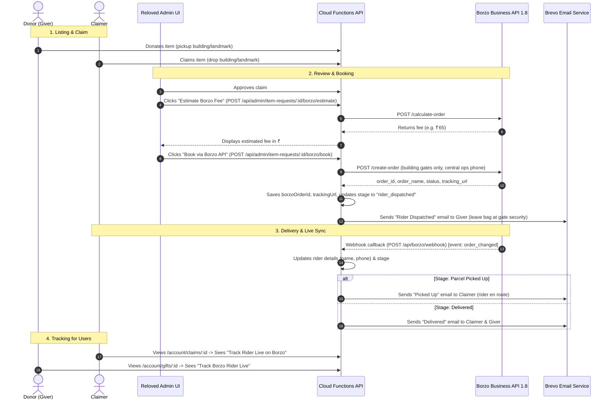

# Reloved — Borzo Setup & End-to-End Delivery Architecture

**Status:** Fully Wired End-to-End (Ready for `BORZO_AUTH_TOKEN`)  
**Date:** September 2026  
**Related:** Masked calling via Edesy -> [RELOVED_Call_Masking_Exotel_Setup.md](./RELOVED_Call_Masking_Exotel_Setup.md)

---

## 1. End-to-End Delivery Flow Overview

Reloved protects donor & claimer privacy: flat/wing numbers and personal phone numbers are never handed to couriers or riders. Central ops coordinates the hop building-to-building.



---

## 2. Two Modes (Dual-Track)

Reloved supports **both** modes simultaneously with zero friction:

### Track A — Manual Ops (Launch / Fallback)
- **When used:** `BORZO_AUTH_TOKEN` is blank or rider booked via phone.
- **Workflow:**
  1. In **Admin -> Claim requests**, click **Copy building + rider note**.
  2. Click **Open Borzo** (opens `https://borzodelivery.com/in/`).
  3. Paste building addresses and book using central ops number (`9653273812`).
  4. Advance delivery stages manually (`Notify giver`, `Mark picked up`, `Mark delivered`).

### Track B — Automated Business API (Fully Connected)
- **When used:** `BORZO_AUTH_TOKEN` is set in environment.
- **Workflow:**
  1. In **Admin -> Claim requests**, click **Estimate Borzo Fee** to preview courier charge.
  2. Click **Book via Borzo API** to place order in 1 click.
  3. System automatically sets stage to `rider_dispatched` and sends the security handoff checklist email to the giver.
  4. Borzo assigns a rider -> webhook or "Sync Status" updates the order with rider name, phone, and live map link.
  5. Both giver and claimer see live tracking in their account.

---

## 3. Environment Variables Needed

To activate automated Track B, provide the following in `firebase-backend/functions/.env.reloved-digital` (or Cloud Functions secrets):

```env
# 1. Borzo Business API Token (REQUIRED for auto-ordering)
# Get from apitest.borzodelivery.com (test) or borzodelivery.com/in (prod) -> Integration -> API Token
BORZO_AUTH_TOKEN=your_token_here

# 2. Borzo API Base URL (OPTIONAL, defaults to test base)
# Test:
BORZO_API_BASE=https://robotapitest-in.borzodelivery.com/api/business/1.8
# Production:
# BORZO_API_BASE=https://robot-in.borzodelivery.com/api/business/1.8

# 3. Central Ops Phone (ALREADY CONFIGURED: 9653273812)
# The phone riders call. Personal donor/claimer numbers are NEVER sent to Borzo.
BORZO_OPS_PHONE=9653273812

# 4. Webhook Callback Secret (OPTIONAL)
# From Borzo Personal cabinet (Integration -> Webhooks) for HMAC signature verification
BORZO_CALLBACK_SECRET=
```

---

## 4. Webhook Configuration in Borzo

In the Borzo Business Cabinet:
1. Navigate to **Integration** -> **Webhooks / Callback URL**.
2. Set the Callback URL to:
   ```
   https://reloved-digital.web.app/api/borzo/webhook
   ```
3. Copy the **Callback Secret Key** and paste it into `BORZO_CALLBACK_SECRET` in `.env.reloved-digital`.

---

## 5. API Endpoints Wired in Reloved

| Endpoint | Method | Role | Description |
|---|---|---|---|
| `/api/admin/borzo/status` | GET | Admin | Checks token validity, balance, and test vs live environment. |
| `/api/admin/item-requests/:id/borzo/estimate` | POST | Admin | Calculates real-time fee (₹) for pickup & drop buildings. |
| `/api/admin/item-requests/:id/borzo/book` | POST | Admin | 1-click order creation on Borzo, attaches tracking URL, emails giver. |
| `/api/admin/item-requests/:id/borzo/sync` | POST | Admin | Polls Borzo for latest order status, assigned courier name & phone. |
| `/api/admin/item-requests/:id/borzo/cancel` | POST | Admin | Cancels order on Borzo and marks claim delivery as failed. |
| `/api/borzo/webhook` | POST | Public | Borzo event receiver. Validates HMAC signature and auto-advances stages. |
| `/api/donor/item-requests` | GET | Donor | Returns live `borzoTrackingUrl`, `borzoCourier`, and `deliveryStatus` to claimer. |
| `/api/donor/submissions` | GET | Donor | Returns active claim `borzoTrackingUrl` and `deliveryStatus` to giver. |

---

## 6. What to do right now

1. To test with **Test API**:
   - Register on https://apitest.borzodelivery.com
   - Copy the token from **Integration** -> paste as `BORZO_AUTH_TOKEN=` in `.env.reloved-digital`.
   - Admin UI will immediately switch from `Manual Track A` to `Test API (1-click Ready)`.
2. To go live with **Production API**:
   - Register or log in to https://borzodelivery.com/in
   - Email `api.in@borzodelivery.com` with your registered mobile/email to enable the Business API.
   - Paste the production token into `BORZO_AUTH_TOKEN` and set `BORZO_API_BASE=https://robot-in.borzodelivery.com/api/business/1.8`.
