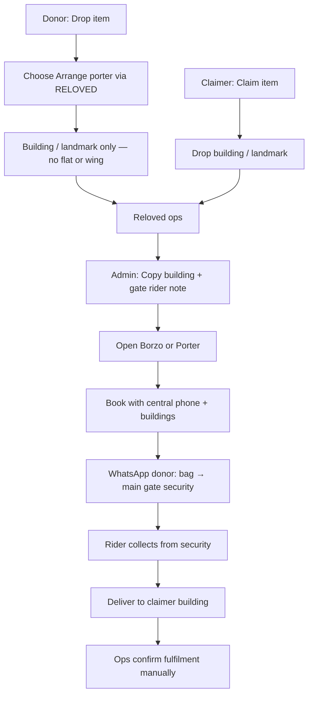

# Reloved delivery ops — launch path (for client group)

**From:** Totem (with Reloved)  
**Date:** 9 September 2026  
**Purpose:** What we implemented on your request, the honest privacy limit, happy path, and edge cases that need **client decisions**.

---

## Privacy (honest)

Building-only pickup + a **central Reloved number** reduces exposure of flat/wing and personal mobiles. It is **not absolute privacy**.

Borzo / Porter still need:

- enough pickup / drop location to finish the job  
- a **reachable phone** when riders call, addresses fail, or deliveries fail  

Someone must **operate** that number. Absolute privacy needs Phase 2 masked calling + confirmation of what each courier shows riders.

---

## Do we need another phone number?

| Option | Timing | Recommendation |
|--------|--------|----------------|
| **Aakash `9653273812` for first deliveries** | Now | **Yes — OK for first couple of runs**, if that phone is answered during delivery windows |
| New prepaid SIM (Totem / Reloved) | Same day (shop) | When volume grows or you want ops shared |
| Virtual number (Exotel / MyOperator) | 1–2 days + KYC | Better shared ops + logs; still not full mask |
| Masked calling (Twilio / Exotel bridge) | Phase 2 | Rider never sees donor/claimer personal numbers |

There is no reliable “temp mail for phone” for Indian couriers without KYC.

**Launch call:** use **9653273812** now; name a **backup person** who can answer if Aakash is unavailable.

---

## Happy path (what we run at launch)

1. Donor lists item → **Arrange a porter through RELOVED** → Maps **building/landmark only**.  
2. Claimer claims → drop **building/landmark**.  
3. **Reloved / Totem ops** books Borzo or Porter (not auto API yet).  
4. Booking uses **central phone**, gate note: *Collect from main gate security. Do not call flat.*  
5. Donor puts item in a **bag**, hands to **security**.  
6. Rider picks up → drops at claimer building.  
7. Status updates via **ops WhatsApp / email** until SMS automation is live.

---

## Who does what (launch)

| Role | Responsibility |
|------|----------------|
| **Who books the rider** | Reloved / Totem **ops** (manual) |
| **Who pays delivery fee** | **Claimer / receiver** (product policy) |
| **Pickup address** | Donor building/landmark (no flat/wing) |
| **Drop address** | Claimer building/landmark |
| **Phone on booking** | Central Reloved number (interim: Aakash) |
| **Driver sees personal numbers?** | **Should not**, if ops never pastes donor/claimer numbers into Borzo/Porter |
| **Courier may still show** | The **central** booking number to the rider |

---

## What we already implemented (your request)

- Privacy banner: no flat / wing; building or landmark only  
- Soft warning if someone types flat/wing  
- Admin: Copy pickup text + Open Borzo / Porter / Maps  
- Rider clipboard note: main gate security; do not call flat  
- Porter fee: **claimer pays**  
- Partner WhatsApp / email handoff  
- QR kit: website + Instagram  

**Still manual / Phase 2:** deep Borzo auto-fill API, auto “rider dispatched” SMS, masked calling, full failure automation.

---

## Edge cases — need CLIENT DECISION

| Edge case | Proposed launch approach | Decide |
|-----------|--------------------------|--------|
| Donor not at pickup | Security holds bag; ops sends checklist | Confirm |
| Claimer not at drop | Leave with claimer building security **or** reschedule | Pick default |
| Failed pickup | Ops rebooks or cancels; item stays with security | Who pays rebook? |
| Failed delivery | Ops rebooks / return-to-origin | Who pays reverse? |
| Reschedule / cancel | Ops + courier app | Who may cancel? |
| Wrong / incomplete address | Ops answers central line; updates building | Accept |
| Rider calls central number | Aakash (or backup) answers in delivery windows | Name backup |
| Lost / damaged | Case-by-case + courier claim if any | Liability with legal |
| Mind change after claim | Free cancel before dispatch; after = courier fees | Fee policy |
| Status to all 3 parties | Manual WhatsApp until SMS ready | Accept for launch |
| Courier fails | Switch Borzo ↔ Porter | Accept |
| Data after fulfilment | Keep building + ref; no flat by design | Retention days |
| Abuse of contacts | Admin-only access | Who has admin? |
| Automate later | API + mask + SMS = Phase 2 | Agree scope |

---

## Suggested group message (copy/paste)

> We’ve implemented the launch logistics path you asked for: building-only privacy prompts, ops Borzo/Porter divert with main-gate rider note, claimer pays porter, partner handoff, and QR kit.  
>  
> **Privacy is improved, not absolute** — the courier still needs buildings + a reachable phone. For the first deliveries we’ll use a **central ops number** (Aakash’s line) that someone answers when riders call.  
>  
> Attached / linked: happy path + edge cases. Please confirm the decision column (failed pickup/drop, who pays rebook/return, backup phone operator, manual WhatsApp vs waiting for auto SMS). Phase 2 covers full API, masked numbers, and deeper failure automation.

---

## Files

- Visual canvas (Cursor): `reloved-logistics-ops-flow`  
- This share doc: `Docs/RELOVED_Logistics_Ops_Flow_Client.md`
