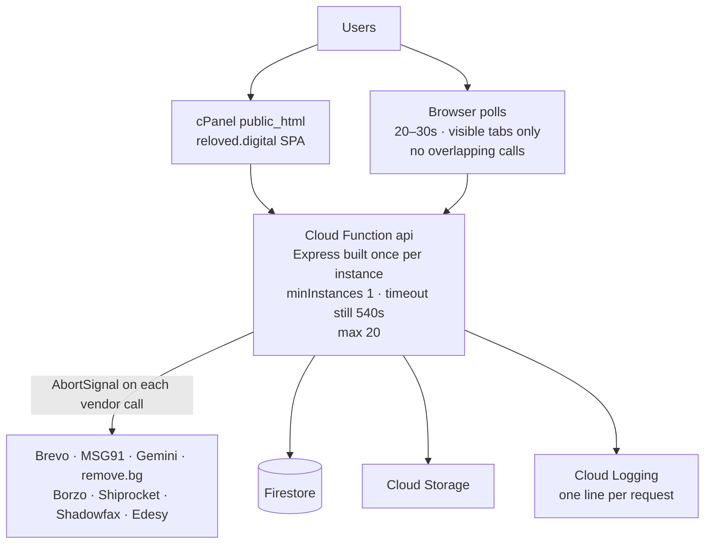

# Scalability Phase 0 — Production Hotfix Plan

**Status:** action plan only. No production code was changed to write this file.
**Depends on:** `docs/SYSTEM_DESIGN_1000_USERS.md` and `docs/SCALABILITY_ROADMAP_1000_PLUS.md` (28 Sep 2026), re-checked against the current source.
**Date:** 28 Sep 2026.

This is not a second system design. It is the short list of changes to make **before** Cloud Tasks, a worker function, or Redis.

Capacity language for every later phase, including this hotfix:

| Role | Concurrent users |
|---|---|
| Business target | **1000+** (1,000 is the minimum, not the ceiling) |
| Primary engineering target | **1,500** |
| Stress / headroom | **2,000** |
| Verified capacity | **Unknown until k6** |

Registered users, concurrent users, and RPS are different. 10,000 accounts can exist while 1,500 browsers are open, and those 1,500 browsers produce whatever RPS the polls and Give/Claim flows create. Phase 0 does not try to prove any of those bars. It makes the current function safe enough to measure them.

```text
CURRENT SYSTEM
  → small safe hotfixes (this document)
  → more stable system
  → load test
  → measure the real bottleneck
  → then the full 1000+ design
```

---

## 1. Objective

Make the live Reloved API safer under concurrent traffic without changing Give, Claim, match, or handover behaviour.

Phase 0 is done when:

- A hung Brevo, MSG91, courier, or remove.bg call cannot hold a function instance for the full 540 seconds.
- Logged-in browsers stop polling as hard as they do today, including in background tabs.
- The Express app is not rebuilt on every request.
- One warm instance absorbs cold starts.
- We can see errors, latency, and a real health check.
- A k6 run on staging has produced numbers. Those numbers, not this document, decide Phase 1.

Phase 0 does **not** try to prove 1,000, 1,500, or 2,000 concurrent users. Those are the bars the later load test records.

---

## 2. Current System Summary

Verified in code, not only in the design doc.

| Piece | What is true today |
|---|---|
| Frontend | React SPA. Live files are cPanel `public_html` on `reloved.digital` (SSH-checked 28 Sep 2026). No Node backend on that account. The built JS calls `https://asia-south1-reloved-digital.cloudfunctions.net/api`. Firebase Hosting is a second static URL, not this domain's root. |
| API | One function `api` in `firebase-backend/functions/src/index.ts`. Region `asia-south1`. Memory `1GiB`. `timeoutSeconds: 540`. `maxInstances: 20`. No `minInstances`. No explicit concurrency. |
| App bootstrap | Every invocation does `const { createApp } = await import("./app")` then `createApp()`. The dynamic import is cached by Node after the first call. **Express is constructed again on every request.** The lazy import must stay at the top of the handler: the comment in `index.ts` says module-level Admin SDK init hangs Firebase deploy discovery. |
| Data | Firestore via Admin SDK. Photos via `lib/storage.ts` to bucket `reloved-digital-uploads`. |
| Photo AI | `lib/photoAnalyze.ts` runs **inside this same function**. Gemini text calls abort at 28s. Image-edit attempts abort at 90s, up to 4 rounds. remove.bg (`fetch` around line 495), Storage re-fetch (`fetchImageBuffer`), and the legacy Lightsail relay have **no abort**. |
| Email / SMS / courier | `lib/notifications.ts` (Brevo), `lib/msg91Sms.ts`, `lib/borzo.ts`, `lib/shiprocket.ts`, `lib/shadowfax.ts`, `lib/callMasking.ts` use `fetch` with **no timeout**. The only abort in the email path is the optional OTP relay in `routes/otp.ts` (4s). |
| Health | `GET /api/health` exists in `app.ts`. It returns `ok: true` without reading Firestore, and it includes MSG91 template status. |
| Wall | `routes/items.ts` already limits reads (100 + 50 + 50). No cursor. No cache. Authenticated requests also load hide-lists. |
| Notifications | `GET /api/donor/notifications` is not a cheap counter. `matchFlow.ts` loads notification docs **and** the giver's pending claims. |
| Polling | See section 5.1. This is the largest steady-state load in the current code. |
| Rate limit | OTP: one send per target per 10 minutes (`routes/otp.ts`). Claim: weekly cap. Nothing on analyze, contact, or login by IP. |
| Indexes | `firestore.indexes.json` covers the public Wall and OTP. `items.ts` already catches a missing index on the owner "processing" query and falls back. |
| Unbounded reads | User-facing lists are capped. `admin.ts` `POST /repair-public-areas` calls `donorProfiles.get()` with **no limit**. Analytics uses `limit(1500)`. |
| Queue / Redis / K8s | Not in the repo. Do not add them in this phase. |

Give already compresses photos in the browser (`frontend/src/lib/compressImage.ts`) and allows up to 5 photos per item or 30 in bulk (`Give.tsx`). Do not lower those product limits in Phase 0.

---

## 3. Why We Need Phase 0

The full design's main fix is to move photo work and mail onto a worker. That is the right later step. It is the wrong first step.

Until a load test exists, the code already shows three failures that do not need a new architecture:

1. **A vendor call with no timeout inherits the 540s function limit.** One stuck Borzo or Brevo request occupies concurrency that Wall and Claim need. Gemini already has per-attempt aborts; most other `fetch` calls do not.
2. **Every logged-in page polls.** `Navbar` mounts `useDonorUnreadCount` on all public pages (`PublicLayout` → `Navbar.tsx`). The interval is 8s and does **not** check `document.visibilityState`. On `/account`, `useDonorNotifications` polls the same endpoint again, and `DonorDashboard` reloads profile, submissions, claims, and incoming claims every 8s.
3. **Cold start plus per-request Express setup** sits on the user path because `minInstances` is unset and `createApp()` runs per request.

Fix those, measure, then decide whether the worker is actually the bottleneck.

---

## 4. Hotfix Priority Matrix

| Change | Class | Why this class |
|---|---|---|
| AbortSignal on Brevo, MSG91, courier, Edesy, Short.io, remove.bg, image re-fetch | **A** | No timeout today. Stops 540s hangs. Happy path unchanged if limits are generous. |
| Do **not** set function `timeoutSeconds` to 60 | **D** | Photo AI still runs in `api`. A 60s function timeout will fail Give cutouts. |
| Cache the Express app after the first lazy import | **A** | Confirmed per-request `createApp()`. Keep the lazy import. |
| `minInstances: 1` on `api` only | **A** | Cold starts are real. One instance is the cheap version. Not two. |
| Navbar + notification poll backoff, visibility check, in-flight guard | **A** | Confirmed duplicate 8s polls. Frontend-only. Largest RPS cut. |
| Dashboard poll 8s → 20s, keep the visibility check it already has | **A** | Same screen as the notification hook. Four extra API calls per tick. |
| Chat poll: visibility + do not overlap | **A** | 6s in `OrderChatThread.tsx`, no visibility check. Component unmounts when closed, so smaller than the navbar, still easy to stack slow requests. |
| Health check reads Firestore; stop returning template internals | **A** | Endpoint exists but cannot detect a broken database, and it leaks ops detail. |
| One structured log line per request | **A** | Needed to read the load test. No body logging. |
| In-memory rate limit on analyze, OTP request, contact | **A** | Analyze spends Gemini money. Per-instance only; say so in the code comment. |
| Add the owner-processing composite index the Wall already warns about | **A** | Code path exists. Index deploy does not change responses. |
| `limit()` on `donorProfiles.get()` in `repair-public-areas` | **A** | Only unbounded collection read found on a route. Admin-only. |
| Refuse to sign JWTs if `JWT_SECRET` is missing when `K_SERVICE` is set | **A** | One guard. Prevents a bad deploy from using the dev fallback in `lib/auth.ts`. |
| Anonymous Wall 15s in-memory snapshot | **B** | High value, easy to get wrong (hide-list, `lat`/`lng`, owner processing rows). Do it after the first k6 run shows Wall read cost. |
| Security headers on Express + Hosting | **B** | Low risk, not why requests are slow. |
| Cheap `unreadCount` for the navbar so it does not run the full notifications query | **B** | Right follow-up if polling is still hot after the interval change. |
| Cursor on Wall and admin lists | **C** | Hot lists already have limits. Build cursors when the catalogue passes those caps or admin pages time out. |
| Cap Gemini's total campaign (not just each attempt) | **B** | Real retry amplification in `photoAnalyze.ts`. A short cap can fail legitimate cutouts. Tune only with Give QA. |
| `concurrency` / memory changes | **C** | Wrong knob while photo and API share the function. |
| Fire-and-forget email after `res.json` | **D** | Cloud Functions can freeze work that starts after the response. That is how the inline polish already gets lost. Needs a queue, which is Phase 1. |
| Cloud Tasks + `worker` function | **D** | Correct in the full design. Not Phase 0. |
| Second function only for photos, called synchronously by `api` | **D** | Same coupling, more deploys. Do it with a queue or not at all. |
| Redis, Kubernetes, microservices, multi-region, sharding, SQL migration | **D** | Not in the codebase. Not justified by this phase. |
| Signed URL uploads that bypass the function | **D** | Changes Give. Browser compression already exists. |
| Lower bulk photo limit below 30 | **D** | Product limit in `Give.tsx`. Abuse is a rate-limit problem. |

---

## 5. MUST DO NOW

### 5.1 Cut duplicate polling

| | |
|---|---|
| Problem | Logged-in clients generate API traffic on a timer, including on pages that are not the dashboard, including hidden tabs. |
| Why it matters | **ASSUMPTION from the code, not from production metrics:** at 8s, notifications alone are about 125 RPS at 1,000 logged-in tabs, **188 RPS at 1,500**, and **250 RPS at 2,000**, before the dashboard's other calls. Each request reads notifications and pending claims (`matchFlow.ts`). On `/account` the navbar and `useDonorNotifications` both hit that route, and `load()` adds four more calls. The 1,500 and 2,000 cases are why the interval changes now, not only the 1,000 floor. |
| Current behavior | `Navbar.tsx` → `useDonorUnreadCount`: `setInterval(tick, 8000)`, no visibility check. `useDonorNotifications`: another 8s interval; visibility is checked only on `focus`, not on the interval. `DonorDashboard.tsx`: 8s `load()` of profile + submissions + item-requests + incoming-claims, visibility-aware, and it also calls `refreshNotes()`. `OrderChatThread.tsx`: 6s, no visibility check. `FloatingHelpButton.tsx`: 5s, only while a help thread is open. Admin polls are 20–30s; leave them. |
| Recommended change | One in-flight flag per poller (if a request is outstanding, skip the tick). Navbar and `useDonorNotifications`: run the interval only when `document.visibilityState === "visible"`. Navbar interval **30s**. Notification list interval **20s**. Dashboard `load()` **20s** (it already skips hidden and `editing`). Chat: skip when hidden; keep 6–10s only while the thread is mounted. Do not remove polling. Do not add Firestore client listeners (rules deny client reads). |
| Files | `frontend/src/lib/useDonorNotifications.ts`, `frontend/src/pages/public/DonorDashboard.tsx`, `frontend/src/components/chat/OrderChatThread.tsx`. Navbar changes only if the hook changes. |
| Risk | Low. Match updates can take ~20–30s instead of ~8s. |
| Effort | Half a day, including a two-account check. |
| Test | Log in, open `/` and `/account`. In DevTools, notifications must not fire every 8s, must pause on a hidden tab, and must not send a second request while the first is pending. Accept a claim in account A; account B sees it within one interval. |
| Rollback | Revert the frontend deploy. API stays compatible. |

### 5.2 Timeouts on outbound calls that have none

| | |
|---|---|
| Problem | Most vendor `fetch` calls have no `AbortSignal`. The function timeout is 540s. |
| Why it matters | A stuck vendor holds an instance. Wall, login, and claim share that pool (`maxInstances: 20`). |
| Current behavior | Timeouts exist for: OTP email relay (4s), Gemini text (~28s), Gemini image-edit (90s per attempt). No timeout on Brevo (`notifications.ts`, `otp.ts` direct send), MSG91 Flow (`otp.ts`, `msg91Sms.ts`), 2Factor, Borzo, Shiprocket, Shadowfax, Edesy (`callMasking.ts`), remove.bg, `fetchImageBuffer`, Lightsail relay. |
| Recommended change | Add `AbortSignal.timeout(...)` (or the existing `AbortController` + `setTimeout` pattern from `otp.ts`). Suggested limits: email and SMS **8s**, Short.io **5s**, courier and Edesy **20s**, remove.bg **30s**, Storage image fetch **15s**, Lightsail relay **60s**. On timeout, log the vendor name and return the same user-facing error that a 502 would return today. Do not retry inside the request except where the code already retries (remove.bg). Map abort to a caught error so Give/Claim handlers that already `.catch()` email failures still return 201. |
| Do not change | `timeoutSeconds: 540` on the function. Photo analysis still needs the long budget until a worker exists. |
| Files | `lib/notifications.ts`, `lib/msg91Sms.ts`, `routes/otp.ts`, `lib/borzo.ts`, `lib/shiprocket.ts`, `lib/shadowfax.ts`, `lib/callMasking.ts`, `lib/shortIo.ts`, `lib/photoAnalyze.ts` (remove.bg, `fetchImageBuffer`, relay only). |
| Risk | Medium if a limit is shorter than a healthy vendor. 8s is enough for Brevo/MSG91; 20s is enough for a courier book the user is waiting on. If a real book needs longer, raise that one constant. Do not raise the function timeout. |
| Effort | About one day. |
| Test | Unit-level: stub `fetch` to hang and assert the call rejects before 30s. Staging smoke: email OTP, one Give, one claim email, one courier estimate if credentials exist. Confirm a forced hang returns an error instead of spinning. |
| Rollback | Revert the function revision. No data migration. |

### 5.3 Reuse one Express app per instance

| | |
|---|---|
| Problem | `createApp()` runs on every request. |
| Why it matters | Extra CPU on the hot path. Does not fix photo contention. Still worth doing because it is tiny and safe. |
| Current behavior | `index.ts` dynamic-imports `./app` and calls `createApp()` for each request. Routes and middleware are stateless. CORS is configured at creation. |
| Recommended change | Keep the dynamic import **inside** the handler so deploy discovery stays light. Store the created app in a module-level `let app`. Build it once per instance. |
| Files | `firebase-backend/functions/src/index.ts` only. |
| Risk | Low. Do not move `createApp()` to module scope. |
| Effort | Under an hour. |
| Test | Two sequential `GET /api/health` calls on one warm instance both return 200. Deploy discovery (`firebase deploy` dry run or a staging deploy) still completes. |
| Rollback | Revert `index.ts`. |

### 5.4 One warm instance

| | |
|---|---|
| Problem | `minInstances` is unset. The first user after idle pays a cold start (Admin SDK + Express). |
| Why it matters | Cold starts look like random slowness and will distort the load test. |
| Current behavior | Scale to zero. `maxInstances: 20`. Memory stays 1 GiB because photo buffers still live here. |
| Recommended change | Set `minInstances: 1` on the `api` function only. Do not set it to 2. Do not change memory. Do not set `concurrency` in this phase (a low concurrency value makes photo jobs consume the whole instance budget faster). |
| Files | `firebase-backend/functions/src/index.ts`. |
| Risk | Low technically. This is the only Phase 0 item with a standing cloud bill. |
| Effort | Minutes, plus a day of watching the billing metric. |
| Test | Leave staging idle 15 minutes, then `GET /api/health`. Compare latency with a second immediate call. Confirm in the console that the minimum is 1, not 0. |
| Rollback | Set `minInstances` back to 0 and redeploy. Immediate cost stop. |

### 5.5 Health check that means something

| | |
|---|---|
| Problem | `/api/health` reports success even if Firestore is unreachable, and it returns SMS template configuration. |
| Why it matters | An uptime check cannot see an outage. Template status does not belong on a public URL. |
| Current behavior | `app.ts` lazily imports `msg91LifecycleTemplateStatus()` and returns it. |
| Recommended change | `GET /api/health` does one point read (for example `analyticsDaily` doc `_health` or any known doc) with a 2s deadline. Response: `{ ok: true }` or 503 `{ ok: false }`. Remove template details from this route. Keep a separate admin-only status if ops still need it; do not add that unless something already calls the public body. |
| Files | `firebase-backend/functions/src/app.ts`. |
| Risk | Low. Confirm nothing in the frontend parses `sms` off this payload (repo search shows no frontend caller). |
| Effort | About an hour. |
| Test | 200 when Firestore is up. 503 if the emulator is stopped. Body has no template ids. |
| Rollback | Revert the route. |

### 5.6 A log line a load test can use

| | |
|---|---|
| Problem | Failures are `console.error(err)` with no route, status, or duration. |
| Why it matters | After k6, we need to know which route was slow. This is not a monitoring product. |
| Current behavior | Unstructured `console.error` in route catch blocks. |
| Recommended change | Express middleware: generate `x-request-id` (honor incoming header if it is a short token), set it on the response, log one JSON line on finish: `requestId`, method, path **without query string** (query can contain emails), status, duration ms. Do not log bodies, OTP codes, or `Authorization`. |
| Files | `app.ts`. Optional: pass the id into existing `console.error` in the global error handler. |
| Risk | Low. Log volume at a few hundred RPS is still small. |
| Effort | Half a day. |
| Test | One request. Cloud Logging shows one line with status and duration. A request with `?email=` does not log the query. |
| Rollback | Remove the middleware. |

### 5.7 Per-instance abuse limits on the expensive public routes

| | |
|---|---|
| Problem | Anyone can call analyze, contact, and OTP request. OTP is limited per destination, not per caller. Analyze spends Gemini. |
| Why it matters | A script can pin instances and run up the Gemini bill. This is not a substitute for a global limiter. |
| Current behavior | No IP limiter. Analyze accepts multipart up to 15 MB × 30 files (`publicWrite.ts`), which matches the bulk Give limit of 30. Leave that product cap. |
| Recommended change | In-memory token bucket in the function instance, keyed by IP (`x-forwarded-for` first hop) plus route. Starting limits: analyze **10 / 10 min / IP**, OTP request **8 / 10 min / IP**, contact **5 / hour / IP**. Return 429 with the existing `{ error: string }` shape. Document in the helper that 20 instances means the real ceiling is about 20× this, and that is acceptable until the load test shows abuse. Do not add Redis. Do not rate-limit Wall GETs (that would punish shared NATs such as a college Wi-Fi). |
| Files | New `functions/src/lib/instanceRateLimit.ts`. Wire in `routes/publicWrite.ts` (`/donations/analyze-photos`, `/contact`) and `routes/otp.ts` (request only, not verify). |
| Risk | Low–medium. A shared IP can hit 429. Limits above are loose for a household and tight for a script. |
| Effort | Half a day to a day. |
| Test | Burst analyze from one client past the cap. A normal Give of a few photos still works. OTP verify is not limited by this new bucket. |
| Rollback | Remove the middleware. |

### 5.8 Indexes and the one unbounded admin read

| | |
|---|---|
| Problem | The owner processing query in `items.ts` already try/catches a missing index. `repair-public-areas` reads every donor profile. |
| Why it matters | Missing indexes add latency and a fallback path on the Wall for logged-in givers. The repair route can grow without a cap. Neither is the main concurrency bug at 1,500–2,000. Both are safe to close now. |
| Current behavior | Wall index for `publicVisibility + publicStatus + createdAt` is deployed in `firestore.indexes.json`. Processing query is `donorTarget + imageProcessingStatus + createdAt`. Repair uses `donorProfiles.get()`. |
| Recommended change | Add that items composite index. Add `limit(2000)` to the profile read in the repair route (same cap the route already uses for items). Do not rewrite admin analytics in this phase. |
| Files | `firebase-backend/firestore.indexes.json`, `routes/admin.ts` repair handler only. |
| Risk | Low. Index builds can take minutes; they do not block reads of other queries. A limit on repair could skip profiles beyond 2,000. That route is a manual admin tool, not a user flow. Say that in the handler comment. |
| Effort | About an hour, plus index build time. |
| Test | Logged-in giver with a processing drop still sees it on the Wall (no warning in logs). Repair route returns without a full collection scan. |
| Rollback | Indexes can stay (unused indexes are harmless). Revert the limit if a repair must see more rows; do that as a one-off script, not by removing the cap permanently. |

### 5.9 Production JWT secret guard

| | |
|---|---|
| Problem | `lib/auth.ts` falls back to `"reloved-firebase-dev-jwt-change-me"` if `JWT_SECRET` is empty. |
| Why it matters | A bad deploy would mint tokens anyone can forge. This is a one-condition guard, not a security project. |
| Current behavior | Fallback is always available. Local emulator needs it. |
| Recommended change | If `process.env.K_SERVICE` is set (Cloud Functions / Cloud Run) and `JWT_SECRET` is missing, throw on first sign/verify. Keep the fallback for local. |
| Files | `lib/auth.ts`. |
| Risk | Low if production already has `JWT_SECRET` (`.env.example` treats it as required). High only if production is accidentally running on the fallback today — in that case this guard **should** fail the deploy, and the secret must be set before shipping. Check the deployed env before merging. |
| Effort | Under an hour, plus the env check. |
| Test | Local requests still work without `K_SERVICE`. With `K_SERVICE=1` and an empty secret, login returns 500 rather than a token. |
| Rollback | Revert the guard. |

---

## 6. SHOULD DO SOON

Do these after the MUST list is deployed, or immediately if the 500-user test shows the matching symptom. Do not start them instead of the MUST list.

| Item | Do it when | Notes |
|---|---|---|
| Anonymous Wall snapshot, 15s, in-memory | k6 shows `GET /api/items` dominating Firestore reads | Skip the cache when `req.session` is set, when `lat`/`lng`/`near` is set, or when status is not `wall`. Logged-in hide-lists and 3 km sort must stay live. Wrong cache is worse than no cache. |
| Navbar unread vs full notifications query | Notification route is still a top Cloud Logging duration after the interval change | `useDonorUnreadCount` only needs a number. Today it calls the full handler in `matchFlow.ts`. A `?view=count` branch is a small API add. |
| Gemini overall deadline | Give logs show one analyze call running many minutes | Cap the whole `analyzePhotos` call (for example 180s) **after** a staging Give with cutouts still succeeds. Do not do this blindly. |
| Security headers | A quiet follow-up deploy | `X-Content-Type-Options`, `Referrer-Policy`, and a tight CORS allowlist (`reloved.digital`, `reloved-digital.web.app`, localhost). Test the real SPA origin before enforcing CORS. Hosting headers in `firebase.json` do not cover the direct Cloud Functions URL the SPA uses. |
| Admin list cursors | An admin page times out or scans feel slow | Not the user Wall. User Wall already has hard limits. |

---

## 7. CAN WAIT

| Item | Why it waits |
|---|---|
| Cursor pagination on the public Wall | Responses are already capped at 100/50/50. Cursors matter when the live catalogue is larger than that window. Confirm the count before building UI. |
| Rewriting `admin.ts` analytics (`limit(1500)` scans) | Admin traffic is a handful of people. It is not the concurrent-user path. |
| Changing function memory or concurrency | Memory is 1 GiB because photo buffers are in this process. Concurrency tuning before the split will starve either photos or the API. |
| Shorter donor JWT (365d → 30d) | Product change, not a capacity fix. |
| CI pipeline | Useful, not required to make the function safer this week. |
| Daily Firestore export | Belongs with the backup section of the full design. Does not change request latency. |
| Help-thread 5s poll | Only runs while that panel is open. Revisit if logs show it. |

---

## 8. DO NOT DO YET

| Item | Why it waits |
|---|---|
| Cloud Tasks and a `worker` function | This is Phase 1, after measurement. Phase 0 must not half-build it. |
| Dropping `timeoutSeconds` from 540 to 60 | `photoAnalyze.ts` still runs in `api`. Give cutouts will fail. |
| `void sendEmail()` after the HTTP response | The platform can freeze the instance when the response ends. Emails would silently disappear. Timeouts (5.2) are the safe version. The queue is the durable version. |
| A second function that `api` calls and waits on | Extra hop, same user wait, no isolation under load. |
| Redis or Memorystore | Rate limits in Phase 0 are in-memory on purpose. Add Redis only if the load test shows a hot Firestore counter. |
| Kubernetes, Nginx, PM2, Docker for this API | The live runtime is Cloud Functions. The old Lightsail Docker path is gone. |
| Microservices | Give, Claim, and match share one transaction and one JWT. |
| Firestore multi-region, replicas, or sharding | Single-region Firestore is not the bottleneck at this size. |
| Moving uploads to signed URLs | Changes the Give contract. Browser compression is already in place. |
| Partner allocation implementation | Still 501 stubs. Unrelated to scale. |
| Caching authenticated Wall responses at a CDN | `api.ts` attaches the donor token on public GETs. A shared cache would leak or hide the wrong items. |

---

## 9. Top 5–10 Hotfixes

Implement in this order. Each step is independently deployable.

1. **Outbound timeouts** (5.2). Stops the worst instance pile-up. No product change on the success path.
2. **Polling** (5.1). Largest reduction in steady RPS. Frontend-only rollback.
3. **Reuse Express + warm instance** (5.3, 5.4). Ship in one function deploy after 1 and 2 are in the same revision if convenient. `minInstances: 1` only.
4. **Health + request log** (5.5, 5.6). So the load test is readable.
5. **Rate limits on analyze, OTP request, contact** (5.7).
6. **Index + repair-route limit + JWT guard** (5.8, 5.9).
7. **Stop.** Run the load test in section 12 from 100 through 2,000 concurrent users. Fill the results table. Do not treat 1,000 as the last rung.
8. Only if that test says so: anonymous Wall cache, unread-count shortcut, or a Gemini overall deadline (section 6).

Do not start the worker between steps 6 and 7.

---

## 10. Detailed Implementation Plan

### Deploy 1 — function safety (backend)

- Add abort signals in the vendor clients listed in 5.2.
- Cache `createApp()` as in 5.3.
- Set `minInstances: 1`. Leave timeout at 540 and memory at 1 GiB.
- Health read + request log.
- JWT guard after confirming production `JWT_SECRET` is set.
- Index file + repair `limit(2000)`.
- In-memory rate limits.

**Order inside the deploy:** secrets check first (local), then code, then staging deploy, then smoke, then production. Turn on `minInstances` in that same production deploy so you do not pay for a revision you are about to replace.

**Smoke:** email OTP, Google sign-in if used, Wall load, Give with one photo (catalog and, if `RELOVED_PHOTO_BG_REMOVE=1`, cutout), claim, giver accept. Courier book only if that environment is allowed to spend.

### Deploy 2 — frontend poll (cPanel `public_html`, not the API server)

- Polling changes in 5.1.
- No API contract change.
- Ship the Vite build to the live document root, `public_html` on the GoDaddy account. `firebase deploy --only hosting` updates `reloved-digital.web.app` only. It does not update `reloved.digital`.

**Smoke:** hidden-tab network panel stays quiet on `https://reloved.digital`. Two browsers still see a new claim within 30s.

### Deploy 3 — only what the test proves

- If Wall reads dominate: anonymous snapshot from section 6.
- If `/api/donor/notifications` still dominates: `?view=count` for the navbar.
- If analyze duration is the long tail: Gemini campaign deadline, with Give QA.

### What "files likely affected" means in practice

| Hotfix | Touch |
|---|---|
| Timeouts | `lib/notifications.ts`, `lib/msg91Sms.ts`, `lib/borzo.ts`, `lib/shiprocket.ts`, `lib/shadowfax.ts`, `lib/callMasking.ts`, `lib/shortIo.ts`, `lib/photoAnalyze.ts`, `routes/otp.ts` |
| Express reuse, min instances | `functions/src/index.ts` |
| Health, logs, CORS later | `functions/src/app.ts` |
| Rate limit | new helper + `publicWrite.ts` + `otp.ts` |
| Index | `firestore.indexes.json` |
| Repair cap | `routes/admin.ts` (one handler) |
| JWT | `lib/auth.ts` |
| Polling | `useDonorNotifications.ts`, `DonorDashboard.tsx`, `OrderChatThread.tsx` |

No Firestore data migration. No change to claim transactions in `donor.ts`.

---

## 11. Phase 0 Architecture Diagram

Same system as today. The new boxes are limits and visibility, not new services.



Photo analysis, email, and courier booking still happen inside `api`. That is intentional until the load test.

---

## 12. Load Testing Plan

**Tool:** k6 against **staging**, not production. Seed a few hundred items and donor JWTs. Do not send 500 real OTPs through MSG91. Do not run Gemini at 500 virtual users; cap the analyze scenario at 2–3 VUs or mock it.

**When:** after Deploy 1 and Deploy 2. Not before.

### Ladder

Same rungs as the system design. Phase 0 runs them **on the current function** (photo AI still inside `api`) so the numbers show the real bottleneck. A miss at 1,500 or 2,000 does not fail the hotfix. It tells Phase 1 what to fix.

| Concurrent users | Purpose | Hold |
|---:|---|---|
| 100 | Baseline | 5 min |
| 250 | Early validation | 5 min |
| 500 | Medium load | 10 min |
| 750 | High load | 10 min |
| 1,000 | Minimum production target | 15 min |
| 1,500 | Primary scalability target | 15 min |
| 2,000 | Stress / headroom | 10 min |

Ramp about 1 minute between steps. Abort if the error rate stays above 10% for a minute.

**Mix (approximate):** 50% Wall + item detail, 30% logged-in poll at the **new** intervals, 10% chat poll, 10% claim writes on distinct items. Analyze stays at a few VUs. Do not point 2,000 virtual users at Gemini.

### Record

For every level: RPS, successful requests, failed requests, P50, P95, P99, error rate, CPU, memory, function instance count, cold starts, Firestore reads, Firestore writes, external API latency. Queue depth and worker time stay blank until a worker exists.

| Concurrent Users | RPS | P50 | P95 | P99 | Error % | CPU | Memory | Result |
|---:|---:|---:|---:|---:|---:|---:|---:|---|
| 100 | | | | | | | | |
| 250 | | | | | | | | |
| 500 | | | | | | | | |
| 750 | | | | | | | | |
| 1000 | | | | | | | | |
| 1500 | | | | | | | | |
| 2000 | | | | | | | | |

### How to read the result

| If the test shows | Phase 1 starts with |
|---|---|
| Long analyze / polish requests occupying instances | Worker + Cloud Tasks for photo, as in the system design. Still not microservices. |
| `/api/donor/notifications` or dashboard routes still dominate | Cheaper unread query, then consider slower polls. Not a new database. |
| `GET /api/items` read cost dominates | Anonymous in-memory snapshot (section 6). |
| Errors are courier/email timeouts | Raise that one vendor limit. Do not raise the function timeout. |
| 1,000 and 1,500 both meet the gates, and 2,000 is understood | Do not build the worker yet. Re-test when traffic or the catalogue grows. |

### Gates

Apply these to the **1,000** and **1,500** rows (analyze VUs excluded). Record the same fields at **2,000** even when a gate misses. P50 and P99 are recorded at every level.

| Metric | Acceptable at 1,000 and 1,500 |
|---|---|
| Error rate | under 1% |
| P95 | under 1.5s |
| Health | 200 throughout |

Do not write "handles 1,000", "handles 1,500", or "handles 2,000" unless that row was actually measured. Verified capacity is the highest row that met the gates, and it stays **unknown** until the table is filled.

---

## 13. Cost Impact

| Hotfix | Cost |
|---|---|
| Vendor timeouts | **No cost.** Can reduce wasted function time. |
| Slower polling | **No cost.** Fewer Firestore reads. This is the main saving. |
| Reuse Express app | **No cost.** |
| `minInstances: 1`, 1 GiB | **Low to medium.** One always-available instance. Budget on the order of tens of USD per month; confirm in Cloud Billing after a week. Do not turn on a second minimum instance in Phase 0. |
| Health Firestore read | **No meaningful cost** at one read per uptime check. |
| Request logs | **Low**, if it is one line and no bodies. |
| In-memory rate limit | **No cost.** |
| Composite index | **No monthly fee.** |
| Anonymous cache (later) | **No cost.** Cuts reads. |
| Cloud Tasks / worker | **Not in Phase 0.** Small usage cost later, plus a second function. |
| Redis | **Not in Phase 0.** Would be the expensive add (instance or a VPC connector). |
| Extra `maxInstances` | **Potentially expensive** if photo jobs fan out. Leave the cap at 20. |
| Monitoring alerts | **Low.** A handful of Cloud Monitoring policies stay inside free tiers at this size. Add them when the log line exists: 5xx rate over 5% for 5 minutes, and instance count pinned at 20 for 5 minutes. Skip a large dashboard. |

Cheapest path: Deploy 1 + Deploy 2 + one warm instance + the k6 run. Anything with a new GCP product waits for that run.

---

## 14. Rollback Strategy

| Deploy | Rollback | Data risk |
|---|---|---|
| Function revision (timeouts, Express cache, health, logs, rate limit, JWT guard, repair limit) | Cloud Functions revision rollback, or redeploy the previous git SHA | None. In-memory rate-limit state disappears on rollback, which is fine. |
| `minInstances` | Redeploy with minimum 0 | None. Billing stops when the idle instance goes away. |
| Firestore index | Leave it. Deleting an index is optional and not required to roll back code. | None. |
| Hosting (poll intervals) | Restore the previous `public_html` `index.html` and `assets/` on cPanel. Firebase Hosting rollback only affects `web.app`. | None. Old SPA still works with the new API. |
| JWT guard failed because the secret was missing | Set `JWT_SECRET`, redeploy. Do not remove the guard to "unbreak" production. | Existing sessions stay valid once the same secret is restored. |

Feature flags are unnecessary for this phase. Each deploy is small enough to revert whole.

If a timeout is too short in production: raise that one constant and redeploy. Do not disable all timeouts.

---

## 15. Phase 0 Definition of Done

- [ ] Brevo, MSG91, Borzo, Shiprocket, Shadowfax, Edesy, Short.io, remove.bg, and Storage image fetch cannot wait forever (5.2).
- [ ] Function `timeoutSeconds` is still 540 while photo AI lives in `api`.
- [ ] `createApp()` runs once per instance, and the import stays lazy (5.3).
- [ ] `minInstances` is 1 on production `api` (5.4).
- [ ] Navbar and notification polls do not run every 8s, do not run in hidden tabs, and do not overlap (5.1).
- [ ] Dashboard refresh interval is 20s and still pauses while hidden or while the profile form is being edited.
- [ ] `GET /api/health` reads Firestore, returns no template secrets, and is checked from outside (5.5).
- [ ] Each API response logs one line with status and duration, without query strings or bodies (5.6).
- [ ] Analyze, OTP request, and contact return 429 when one instance sees a burst (5.7).
- [ ] Owner-processing index is deployed; `repair-public-areas` does not read an unlimited profile collection (5.8).
- [ ] Production refuses to sign tokens when `JWT_SECRET` is empty (5.9).
- [ ] Staging smoke: login, Wall, Give, claim, giver decision.
- [ ] k6 results are recorded at 100, 250, 500, 750, 1,000, 1,500, and 2,000 concurrent users (section 12). Empty cells are not guesses.
- [ ] A written note says what dominated latency at 1,000, at 1,500, and at 2,000. Phase 1 is chosen from that note, not started by default.
- [ ] No Cloud Tasks, Redis, or second service was added.

Cursor pagination, security headers, and the anonymous Wall cache are **not** required for this checklist. They are section 6.

---

## 16. Phase 1 — What Comes Next

Phase 1 starts from the load-test note, not from a fixed architecture diagram.

Default expectation, if the test matches what the code suggests:

1. **Photo and non-OTP email move to Cloud Tasks + one `worker` function**, still the same repository and the same Express business logic. That is the first real isolation of Gemini from Wall/Claim. Only then is it safe to drop the API function timeout from 540s toward 60s.
2. **Anonymous Wall cache**, if reads show up in the test.
3. **Cheaper notification read**, if polls are still hot after the interval change.

Still out of scope for Phase 1: Kubernetes, Redis as a default, microservices, a database move, multi-region.

The full target remains `docs/SYSTEM_DESIGN_1000_USERS.md`. Phase 0 does not replace it. Phase 0 earns the right to implement the expensive parts of it.

---

## Appendix — Evidence pointers

| Claim | Where |
|---|---|
| Function size and timeout | `firebase-backend/functions/src/index.ts` |
| Express rebuilt per request | same file, handler body |
| Shallow health | `firebase-backend/functions/src/app.ts` |
| Gemini vs missing fetch timeouts | `lib/photoAnalyze.ts` (`IMAGE_EDIT_TIMEOUT_MS`, remove.bg `fetch`, `fetchImageBuffer`) |
| Brevo without timeout | `lib/notifications.ts` |
| Courier without timeout | `lib/borzo.ts`, `lib/shiprocket.ts`, `lib/shadowfax.ts` |
| Navbar poll on every public page | `PublicLayout.tsx`, `Navbar.tsx`, `useDonorUnreadCount` |
| Second poll on the dashboard | `DonorDashboard.tsx` (`useDonorNotifications` + 8s `load`) |
| Notifications query is heavy | `routes/matchFlow.ts` `GET /notifications` |
| Wall already limited | `routes/items.ts` |
| Unbounded profiles | `routes/admin.ts` `repair-public-areas` |
| JWT fallback | `lib/auth.ts` |
| Bulk photo cap is 30 | `frontend/src/pages/public/Give.tsx` |
