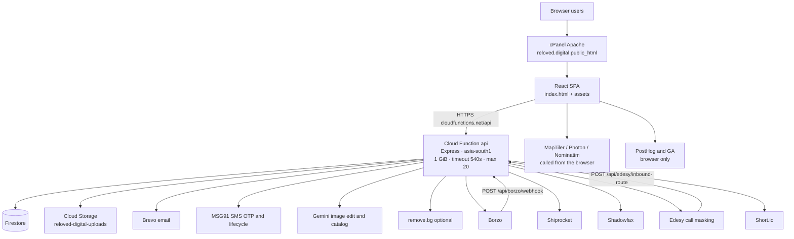
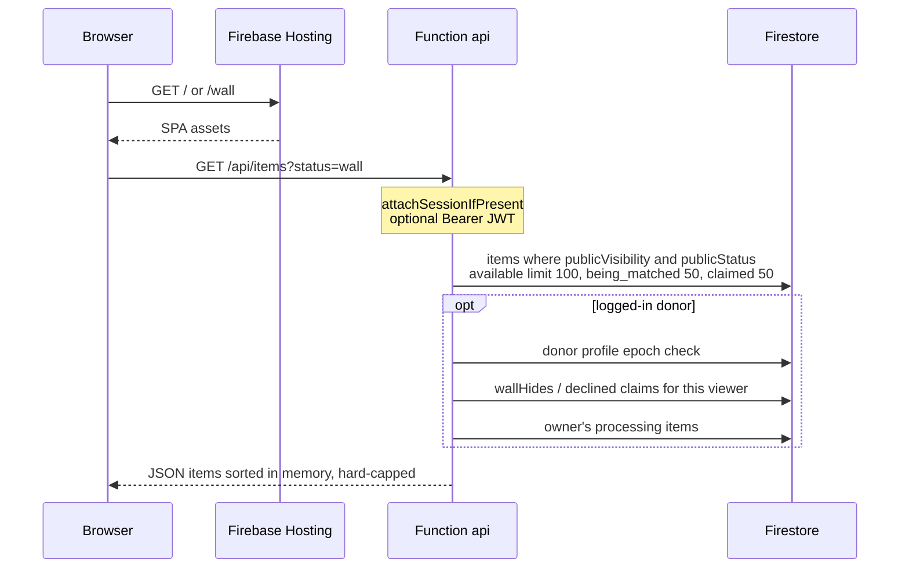
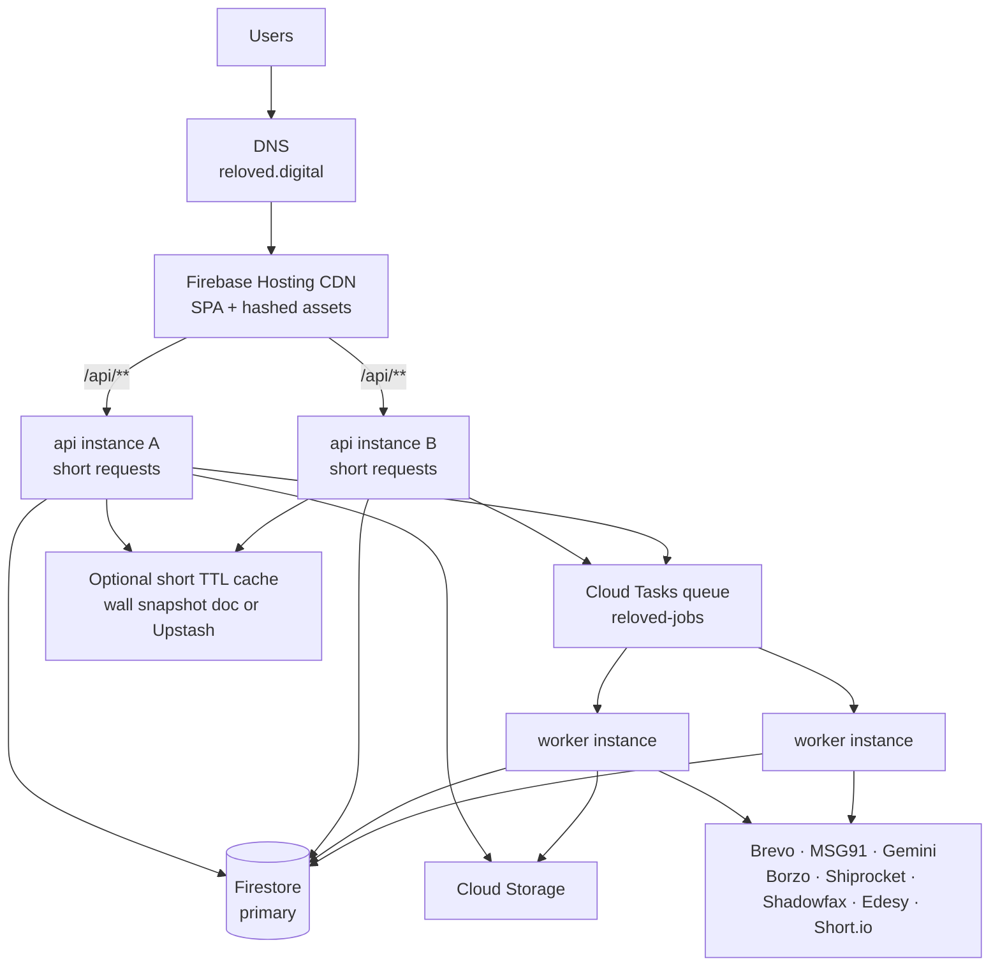
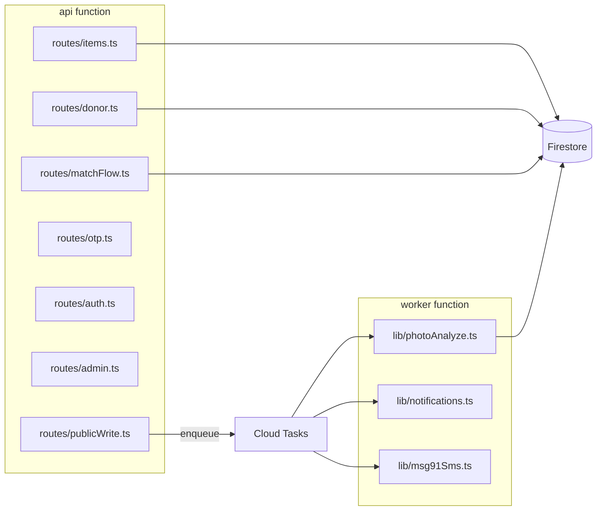
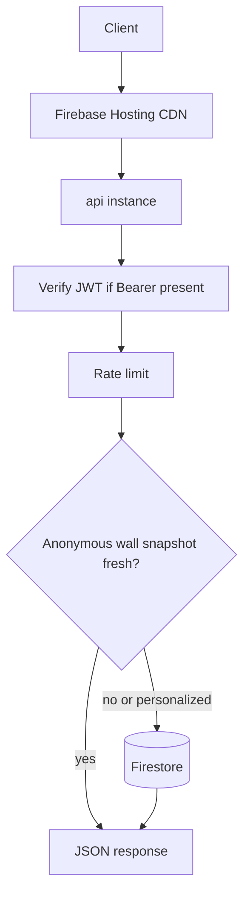
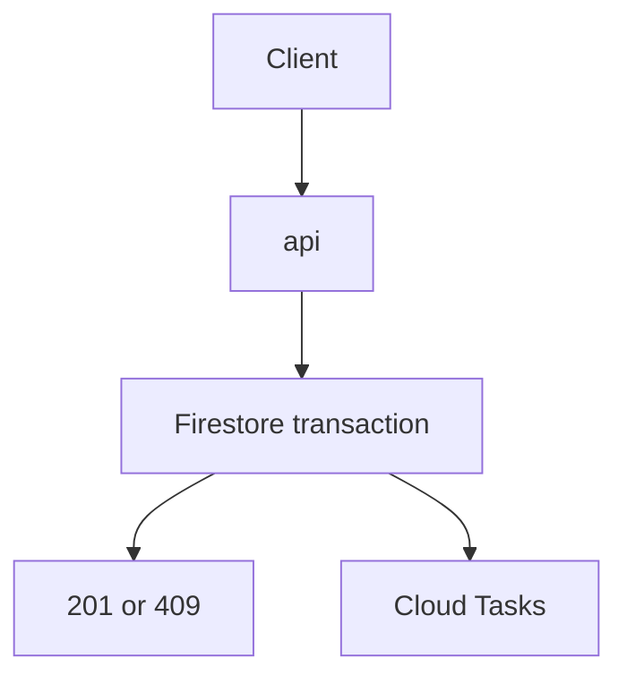
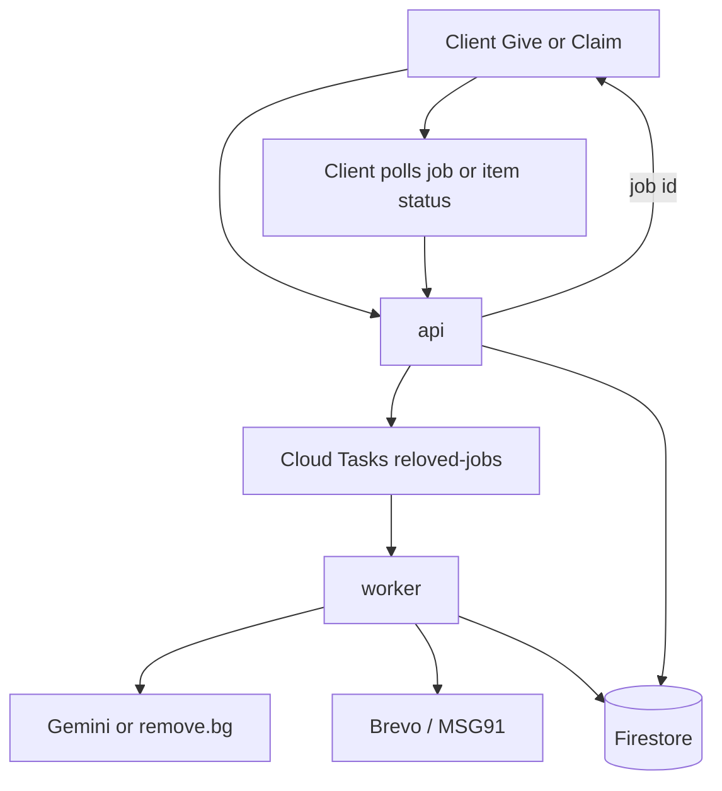
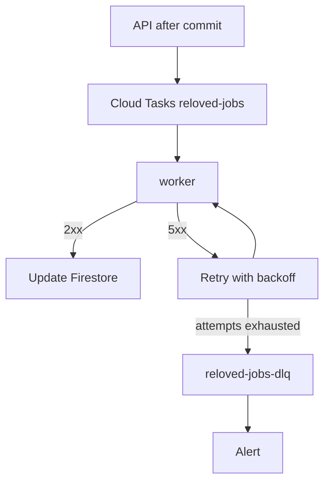
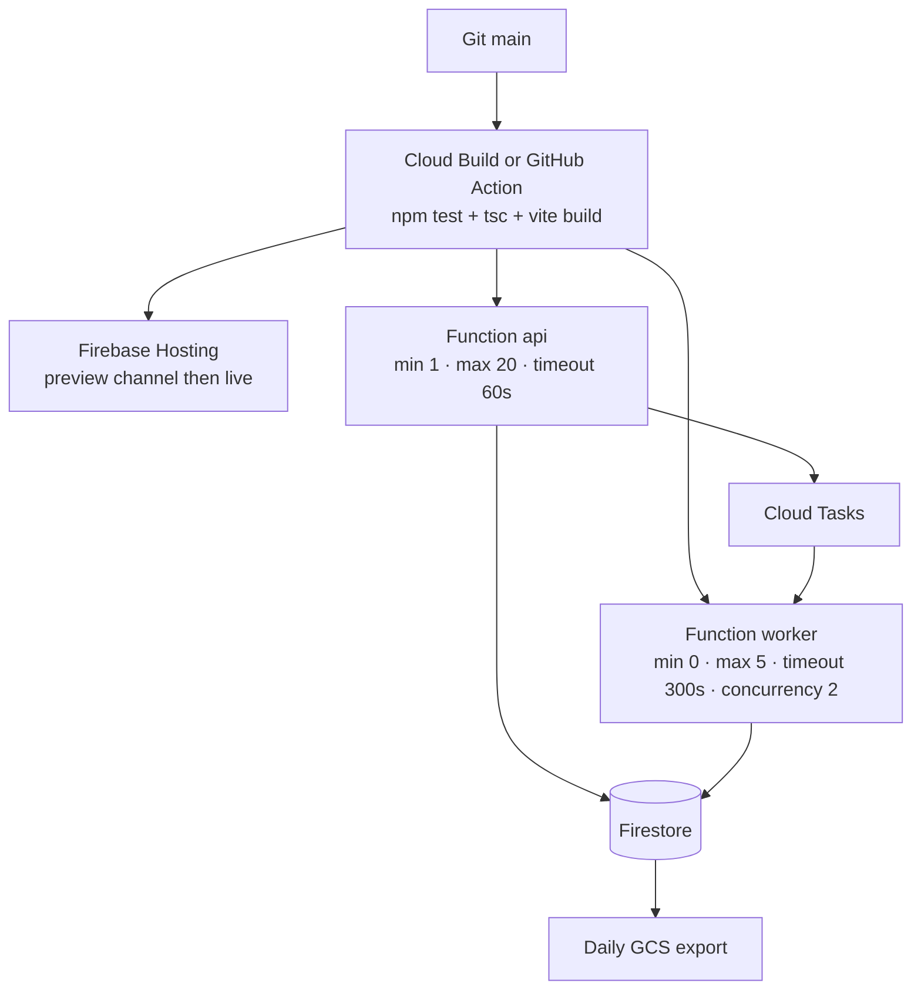
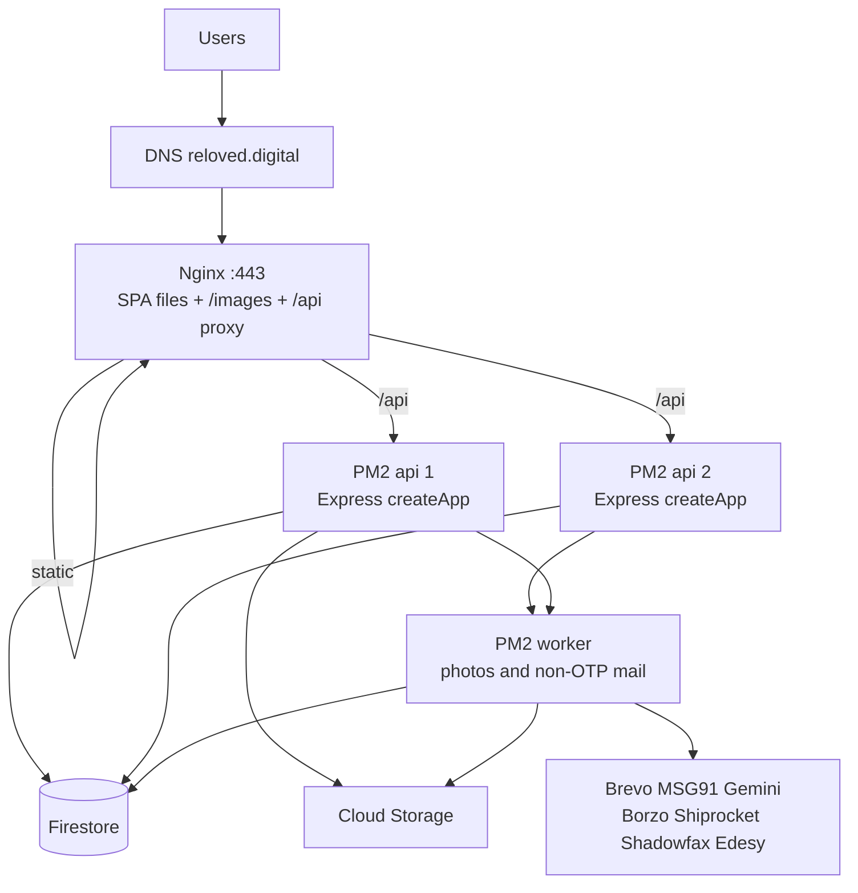

# System Design — 1000+ Users

**Status:** analysis and target design only. No production code was changed for this document.
**Source of truth:** the repository as inspected (frontend SPA, `firebase-backend/functions`, Firestore rules/indexes, Firebase Hosting config).
**Date:** 28 Sep 2026.
**Roadmap:** `docs/SCALABILITY_ROADMAP_1000_PLUS.md` — 1,000 concurrent is the minimum, 1,500 is the primary target, 2,000 is the stress test. Verified capacity is unknown until k6.

This design scales the **current Reloved flow** (Give / Wall / Claim / match / handover / admin). It does not replace the product with a new stack, and it does not split the app into microservices.

Labels used throughout:

- **CURRENT** — what the code and config actually do today.
- **PROPOSED** — incremental changes aimed at 1000+ users, with headroom past the minimum.
- **ASSUMPTION** — a number or behaviour that must be confirmed with load testing or production metrics.

**Three different numbers. Do not collapse them.**

| Name | Meaning |
|---|---|
| Registered users | Accounts that exist. 10,000 registered users can sit in Firestore while almost nobody is online. |
| Concurrent users | Browsers with the SPA open at the same time. This is the load-test virtual-user count. |
| Requests per second | What those browsers actually send. Polling, Wall reads, Give, and Claim turn one concurrent user into a very different RPS. |

| Role | Concurrent users |
|---|---|
| Business target | **1000+** (1,000 is the minimum, not the ceiling) |
| Primary engineering target | **1,500** |
| Stress / headroom | **2,000** |
| Verified capacity | **Unknown until k6** |

---


## 1. Executive Summary

Reloved is a Mumbai Wall of Kindness: people give clothing, footwear, and bags for free, and others claim them. Money does not change hands.

**CURRENT architecture** is already a modular monolith on Firebase:

- React + Vite SPA. **Live site** `reloved.digital` is GoDaddy cPanel (`public_html` on `118.139.180.238`, Apache + `.htaccess` SPA fallback). Confirmed over SSH on 28 Sep 2026. Firebase Hosting (`reloved-digital.web.app`, `firebase.json`) is a second static target in the repo, not the domain's document root.
- The built SPA calls `https://asia-south1-reloved-digital.cloudfunctions.net/api` directly. cPanel does not proxy `/api`. There is no Node, npm, or pm2 on that account.
- One 2nd-gen Cloud Function, `api`, region `asia-south1`, running Express (`firebase-backend/functions/src/index.ts`, `app.ts`).
- Firestore for all product data. Client writes are denied; the Admin SDK in the function is the only writer (`firestore.rules`).
- New uploads go to Cloud Storage bucket `reloved-digital-uploads` (`lib/storage.ts`). Catalogue images already on the Wall are also served from cPanel `public_html/images/` (about 221 files under `wall-items/`, one-year cache in `.htaccess`).
- Custom HS256 JWTs (`lib/auth.ts`). Firebase Auth is used only to verify a Google ID token.
- External calls inline on the request: Brevo email, MSG91 SMS, Gemini (and optional remove.bg) photo analysis, Borzo / Shiprocket / Shadowfax, Edesy call masking, Short.io.

There is **no Redis, no job queue, no PM2, no Nginx config, no Kubernetes, and no CI workflow** in this repository. The old Express + Postgres `backend/` (Lightsail) has been removed. Root `README.md` still mentions a Lightsail photo relay; **current code runs photo analysis inside the Cloud Function** (`lib/photoAnalyze.ts`). `PHOTO_ANALYZE_RELAY_URL` is documented as legacy and unused.

**Registered users are not the hard problem.** Firestore already holds far more than 1,000 accounts. The hard problem is **concurrent sessions plus RPS**, especially polling and photo jobs that share one function. Planning uses 1,500 concurrent as the primary case and 2,000 as the stress case, because a system that is full at exactly 1,000 has no room for a spike. The bottlenecks below show up before that headroom exists:

1. Photo AI and the public API share one function with `timeoutSeconds: 540` and `memory: "1GiB"`. A Give-flow cutout can hold an instance for minutes (`IMAGE_EDIT_TIMEOUT_MS = 90_000`, up to 4 rounds).
2. Logged-in clients poll. Notifications every 8s (`useDonorNotifications.ts`), the donor dashboard every 8s (`DonorDashboard.tsx`), order chat every 6s (`OrderChatThread.tsx`).
3. Email, SMS, and some courier work run before the HTTP response returns.
4. The Wall loads a fixed window (100 + 50 + 50) and sorts in memory. Admin metrics scan up to 1,500 documents per collection.
5. `minInstances` is unset, so cold starts sit on the user path. `maxInstances` is 20.

**PROPOSED architecture:** keep the same Express monolith and business logic. Run it as two processes from the same codebase:

- `api` — short requests (Wall, auth, claim transaction, chat reads), timeout ~60s, at least one warm instance.
- `worker` — photo polish, email, SMS, non-urgent courier side effects, fed by **Cloud Tasks** (already available in the same GCP project; no new always-on queue server).

Add Firestore indexes and cursor pagination where lists are capped. Cache only the anonymous Wall for a short TTL. Add rate limits, outbound timeouts, health checks, and Cloud Monitoring alerts. Validate with k6 before calling the capacity real.

Redis is **optional** at this size. A managed Redis (Memorystore) plus a VPC connector costs more than the rest of the Firebase bill through the 1,500–2,000 validation range and is not required to aim at that range. Use it only if a load test shows hot-key or rate-limit pressure that Firestore cannot absorb cheaply.

---


## 2. Current Architecture




**CURRENT deployment**


| Piece           | What the repo shows                                                                                                                                                               |
| --------------- | --------------------------------------------------------------------------------------------------------------------------------------------------------------------------------- |
| Frontend        | Live: copy the Vite build into cPanel `public_html`. `.htaccess` sends unknown paths to `index.html` and caches `images/` for 1 year. `npm run deploy:hosting` still targets Firebase Hosting, which is not the live domain root. |
| API             | Single function `api` in `functions/src/index.ts`. Lazy-imports `createApp()` **on every request**. CORS `origin: true`.                                                          |
| Database        | Firestore, single database, region tied to the Firebase project (function is `asia-south1`).                                                                                      |
| Files           | Uploaded by the function via Admin SDK, then `makePublic()`. URLs like `https://storage.googleapis.com/{bucket}/{path}`.                                                          |
| Process manager | Cloud Functions runtime. No PM2, no Docker in the live path. `backend/Dockerfile` is gone with the old server.                                                                    |
| Reverse proxy   | None on the live domain. cPanel `.htaccess` does not proxy `/api`. `firebase.json` rewrites `/api/**` only for Firebase Hosting.                                                                 |
| CI/CD           | Manual `firebase deploy`. No `.github/workflows`.                                                                                                                                 |
| Environments    | Production project `reloved-digital`. Local: emulators or `functions/local-server.js`. Env template: `functions/.env.example`. Secrets live in gitignored `.env.reloved-digital`. |


`Docs/RELOVED_PRICING.md` treats Firebase Storage as unused. That is half the picture. `uploadImage()` writes new photos to Cloud Storage. The live Wall also serves files from cPanel `public_html/images/`. Capacity planning has to count both.

---


## 3. Current User Flow

Traced from the frontend routes (`frontend/src/App.tsx`) through `frontend/src/lib/api.ts` into Express routers.

### 3.1 Browse the Wall




Implementation: `routes/items.ts`. Distance for `giver_sends` is computed in the function (`lib/geo.ts`, 3 km). Exact coordinates are not returned on the public item (`types.ts` `toPublicItem`). Logged-in viewers also trigger hide-list reads (`lib/wallHide.ts`).

There is **no cursor**. Clients cannot page past the caps. Growing the catalogue silently drops older rows.

### 3.2 Sign in

Three paths, one `donorProfiles` document (`lib/donorIdentity.ts`):

1. **Email OTP** — `POST /api/otp/request` then `POST /api/otp/verify` (`routes/otp.ts`). Code is SHA-256 hashed, TTL 10 minutes, at most one send per target+channel per 10 minutes. Email goes to Brevo, or to `EMAIL_RELAY_URL` if set (4s abort).
2. **Phone OTP** — MSG91 widget in the browser (`frontend/src/lib/msg91Widget.ts`), then `POST /api/otp/widget-verify`. Server SMS fallback uses MSG91 Flow API (`lib/msg91Sms.ts`) when the widget is not configured.
3. **Google** — Firebase client SDK → ID token → `POST /api/donor/session/google` (`lib/firebaseAuth.ts`). Backend verifies the token and issues **our** JWT.

`POST /api/donor/session` stores the JWT. Frontend keeps it in `localStorage` (`lib/donorSession.ts`). Donor TTL defaults to **365 days** (`DONOR_SESSION_TTL`). Logout bumps `sessionEpoch` on the profile; every authenticated request re-reads the profile to compare epochs (`middleware/session.ts`).

Admin is separate: `POST /api/auth/login`, one email from `ADMIN_EMAIL`, password checked against `ADMIN_PASSWORD_HASH` (bcrypt) or plaintext `ADMIN_PASSWORD` (`routes/auth.ts`). Admin/partner TTL defaults to 7 days.

### 3.3 Give (drop)

`Give.tsx` compresses images in the browser first (`lib/compressImage.ts`, about 0.45 MB, longest edge 1600).

1. `POST /api/donations/analyze-photos` (multipart, up to 15 MB per file, up to 30 files). Mode `catalog` | `cutout` | `full`. Runs Gemini inside the function (`analyzePhotosViaLightsail` is the historical name in `publicWrite.ts`; the implementation is `lib/photoAnalyze.ts`).
2. `POST /api/donations` writes `donationSubmissions` + `items`. Status is auto-approved. If cutouts are required (`RELOVED_PHOTO_BG_REMOVE=1`) and not ready, `publicVisibility` stays false and `imageProcessingStatus` is `processing`.
3. Before the response: admin email, in-app notification, donor confirmation email (failures are logged, not fatal).
4. After the response: `void polishItemImages(...)` continues **on the same instance**. The client can also call `POST /api/donations/polish-item-images`.

A Firestore `onCreate` polish trigger is **not deployed**. Comment in `index.ts`: Eventarc service account was not ready; polish is HTTP + inline best-effort.

### 3.4 Claim and match

`POST /api/donor/item-requests` (`routes/donor.ts`):

- Weekly claim cap (`countDonorRequestsThisWeek`, `DONOR_WEEKLY_REQUEST_LIMIT`).
- Self-claim blocked across email/phone/target (`sessionIsGiver`).
- Previously declined claimers stay hidden (`wallHides`).
- `giver_sends` must be inside 3 km (`assertGiverSendsRadius` in `matchFlow.ts`).
- **Firestore transaction** sets the claim and flips the item to `being_matched`. This is the correct race control for two people claiming one item.

Then, still on the request: claim admin email, claimer email, giver email, in-app notifications.

Match continuation (`registerMatchFlowRoutes` in `matchFlow.ts`), all on `donorRouter`:

- Giver accept/decline, delivery address, schedule propose/respond, handed-over, received, received photo, cancel.
- Courier book/cancel: Borzo, Shiprocket, Shadowfax (`BORZO_BOOKING` is token-gated; Shiprocket and Shadowfax booking default **off** via env flags).
- Chat: `messageThreads` + messages. UI polls every 6s.
- Notifications list polled every 8s.


### 3.5 Admin and partner

`/admin/*` uses a Bearer admin JWT (`middleware/adminAuth.ts`). Dashboard, donations, items, claims, orders, messages, analytics, bulk upload. Several handlers `.limit(500)` or `.limit(1500)` and aggregate in memory (`routes/admin.ts`). Partner allocation mutations are still **501 stubs**.

### 3.6 Other inbound

- `POST /api/contact`, `POST /api/partner-applications`, `POST /api/waitlist`, `GET /api/track/:reference`.
- `POST /api/borzo/webhook` verifies `X-DV-Signature` over the raw body (`routes/borzoWebhook.ts`, `lib/borzo.ts`).
- `POST /api/edesy/inbound-route` for masked-call routing.
- `POST /api/analytics/events` plus daily counters in `analyticsDaily`.
- Browser map geocoding does **not** go through the API (MapTiler, with Photon and Nominatim fallbacks in `AddressAutocomplete.tsx`).

---


## 4. Current System Components


| #   | Area                     | CURRENT                                                                                                                                                                                                                                                                     |
| --- | ------------------------ | --------------------------------------------------------------------------------------------------------------------------------------------------------------------------------------------------------------------------------------------------------------------------- |
| 1   | Frontend                 | React 19, Vite 6, React Router 7, Tailwind 4. No SSR. Client state in React + `localStorage` tokens.                                                                                                                                                                        |
| 2   | Backend                  | Node 22, Express 4, one Cloud Function. Routes mounted in `app.ts`.                                                                                                                                                                                                         |
| 3   | API                      | REST under `/api/*`. JSON and multipart (`lib/multipart.ts`, busboy). No OpenAPI file.                                                                                                                                                                                      |
| 4   | Database                 | Firestore collections in `lib/firestore.ts`: `items`, `donationSubmissions`, `itemRequests`, `donorProfiles`, `otpCodes`, `waitlistSignups`, `contactMessages`, `partnerApplications`, `messageThreads`, `callBridges`, `userNotifications`, `wallHides`, `analyticsDaily`. |
| 5   | Auth                     | `jose` HS256 JWT. Google via Firebase Admin. Donor epoch check hits Firestore on every Bearer request.                                                                                                                                                                      |
| 6   | Request path             | Browser → Hosting or direct `VITE_API_URL` → function → Firestore / vendors. `frontend/src/lib/api.ts` attaches the donor token even on public Wall GETs when a session exists.                                                                                             |
| 7   | External services        | Brevo, MSG91, Gemini, optional remove.bg, Borzo, Shiprocket, Shadowfax, Edesy, Short.io, MapTiler (browser), PostHog (browser).                                                                                                                                             |
| 8   | Uploads                  | Browser compress, then multipart to the function, then Admin SDK `file.save`. Function memory holds the buffer.                                                                                                                                                             |
| 9   | Background work          | None as a separate process. Polish is fire-and-forget on the request instance.                                                                                                                                                                                              |
| 10  | Cron                     | None. No `onSchedule`.                                                                                                                                                                                                                                                      |
| 11  | AI                       | Gemini text + image models in `lib/photoAnalyze.ts`. FAQ bot is client-side keyword match only (`faqContent.tsx`), not an LLM.                                                                                                                                              |
| 12  | Email / SMS              | `lib/notifications.ts` (Brevo templates, plain-text fallback). `lib/msg91Sms.ts` for OTP and lifecycle SMS.                                                                                                                                                                 |
| 13  | Cache                    | Hosting cache headers for static assets. API responses `Cache-Control: no-store`. No application cache.                                                                                                                                                                     |
| 14  | Docker                   | Not used by the live system.                                                                                                                                                                                                                                                |
| 15  | PM2                      | Not used.                                                                                                                                                                                                                                                                   |
| 16  | Nginx                    | Not in repo. Hosting + Cloud Functions front the app.                                                                                                                                                                                                                       |
| 17  | Env                      | `functions/.env.example`, `frontend` `VITE_*`. JWT secret falls back to a hardcoded dev string if `JWT_SECRET` is missing (`lib/auth.ts`).                                                                                                                                  |
| 18  | CI/CD                    | Manual Firebase CLI deploy. Functions predeploy runs `tsc`.                                                                                                                                                                                                                 |
| 19  | Server                   | Google-managed function instances. `maxInstances: 20`. No `minInstances`, no explicit `concurrency`. Default 2nd-gen concurrency is 80 in-flight requests per instance.                                                                                                     |
| 20  | Single points of failure | One function for all traffic; one Firestore database; one region; one admin password in env; vendor accounts (Brevo, MSG91, Gemini, courier) with no circuit breaker; polish work dies if the instance is frozen after the response.                                        |


---


## 5. Current Bottlenecks

Priority: **P0** blocks a 1000-concurrent target or risks an outage under a spike. **P1** will hurt before or at that load. **P2** is correctness, cost, or operability.

### 5.1 Photo AI shares the API function


|                      |                                                                                                                                                                                                                                                                         |
| -------------------- | ----------------------------------------------------------------------------------------------------------------------------------------------------------------------------------------------------------------------------------------------------------------------- |
| Problem              | Give-flow Gemini cutouts and Wall/auth/claim traffic use the same function.                                                                                                                                                                                             |
| Current              | `index.ts`: `memory: "1GiB"`, `timeoutSeconds: 540`, `maxInstances: 20`. `photoAnalyze.ts`: 90s per image-edit attempt, 4 rounds, multiple models. Multipart allows 15 MB × 30 files.                                                                                   |
| Impact               | A handful of concurrent Give sessions can occupy all useful concurrency. Other users see cold starts, 500s, or long queues. 1 GiB plus large buffers risks OOM. 20 instances × 1 GiB is the ceiling, and long requests do not finish just because more instances exist. |
| Recommended solution | Second function `worker` from the same `functions/src`, concurrency 1–2, timeout 300–540s. API timeout 60s. Analyze endpoint enqueues a job and returns a job id.                                                                                                       |
| Priority             | P0                                                                                                                                                                                                                                                                      |
| Complexity           | Medium. Routes stay; only the analyze/polish call path moves.                                                                                                                                                                                                           |


### 5.2 Client polling multiplies load


|                      |                                                                                                                                                                                                                                                                                                                                                                                                                   |
| -------------------- | ----------------------------------------------------------------------------------------------------------------------------------------------------------------------------------------------------------------------------------------------------------------------------------------------------------------------------------------------------------------------------------------------------------------- |
| Problem              | Open tabs generate steady API traffic independent of user actions.                                                                                                                                                                                                                                                                                                                                                |
| Current              | Notifications 8s, donor dashboard 8s, chat 6s, admin layout 20s, admin dashboard 30s. Each authenticated call also reads the donor profile for `sessionEpoch`.                                                                                                                                                                                                                                                    |
| Impact               | **ASSUMPTION:** at today's 8s interval, 1,500 visible logged-in tabs ≈ **188 RPS** on `/api/donor/notifications` alone, and 2,000 tabs ≈ **250 RPS**, before the dashboard's other calls. 1,000 tabs (125 RPS) is the minimum case, not the design case. Each call is several Firestore reads. This is the main steady-state load, not Give/Claim.                                                                                                                                                        |
| Recommended solution | Poll only while `document.visibilityState === "visible"` (notifications interval currently does not check this; dashboard tick does). Back off to 20–30s. Prefer Firestore listeners later only if the client is allowed to read its own notification docs (rules are deny-all today, so this needs a rules change or stay on the API). Short-term: slower polling + ETag/updatedAt so unchanged polls are cheap. |
| Priority             | P0                                                                                                                                                                                                                                                                                                                                                                                                                |
| Complexity           | Low on the client. Medium if adding conditional reads.                                                                                                                                                                                                                                                                                                                                                            |


### 5.3 Synchronous email and SMS on the request


|                      |                                                                                                                                                                                                              |
| -------------------- | ------------------------------------------------------------------------------------------------------------------------------------------------------------------------------------------------------------ |
| Problem              | Brevo and MSG91 latency and failures sit on Give, Claim, match decisions, and OTP.                                                                                                                           |
| Current              | Donation and claim handlers `await` vendor sends (errors are caught). OTP must stay synchronous because the user is waiting for a code. Match emails do not need to block the UI.                            |
| Impact               | A slow Brevo call adds hundreds of ms to seconds. A vendor outage can still burn function time. No retry queue: a caught failure is only a log line.                                                         |
| Recommended solution | OTP stays inline (user is waiting) with the existing 4s relay abort, plus a hard timeout on the direct Brevo fetch. All other mail/SMS go to Cloud Tasks. Idempotency key = `{type}:{entityId}:{recipient}`. |
| Priority             | P0 for match/Give fan-out. P1 for OTP timeout hardening.                                                                                                                                                     |
| Complexity           | Medium. `lib/notifications.ts` callers change from `await sendX` to `enqueue(sendX payload)`.                                                                                                                |


### 5.4 Wall query shape


|                      |                                                                                                                                                                                                                                                                                 |
| -------------------- | ------------------------------------------------------------------------------------------------------------------------------------------------------------------------------------------------------------------------------------------------------------------------------- |
| Problem              | Fixed limits, three parallel queries, in-memory merge, per-viewer hide queries, no cache.                                                                                                                                                                                       |
| Current              | `routes/items.ts`. Composite index exists for `publicVisibility + publicStatus + createdAt` (`firestore.indexes.json`). Authenticated Wall requests cannot be CDN-cached because the donor token is attached (`api.ts`).                                                        |
| Impact               | Fine while the live Wall is under ~200 items. At a larger catalogue, users never see older items. At 1,500–2,000 concurrent browsers, anonymous users still all hit Firestore for the same list. Hide-list reads add 1–2 queries per logged-in Wall view.                              |
| Recommended solution | Cursor pagination (`startAfter`). Anonymous Wall: 15–30s response cache (Hosting/CDN or a single Firestore doc `wallSnapshots/current` rebuilt on item write). Logged-in personalization (hide list, distance) applied after the shared snapshot, or as a second small request. |
| Priority             | P1 (becomes P0 once the catalogue exceeds the caps).                                                                                                                                                                                                                            |
| Complexity           | Medium.                                                                                                                                                                                                                                                                         |


### 5.5 Admin scans


|                      |                                                                                                                                                                                                                                                                     |
| -------------------- | ------------------------------------------------------------------------------------------------------------------------------------------------------------------------------------------------------------------------------------------------------------------- |
| Problem              | Metrics, analytics, repair, and list endpoints read hundreds to thousands of documents per call.                                                                                                                                                                    |
| Current              | `admin.ts`: `limit(500)` on dashboard collections, `limit(1500)` on analytics, some per-row follow-up gets (orders loop loads item + submission).                                                                                                                   |
| Impact               | One admin refresh is cheap today. It will time out or get expensive as history grows, and it competes with user traffic on the same function.                                                                                                                       |
| Recommended solution | Keep admin on the same API, but query by status + `orderBy(createdAt)` with cursors. Maintain `analyticsDaily` (already started) instead of scanning raw collections for charts. Move repair endpoints (`sync-wall-statuses`, `repair-public-areas`) to the worker. |
| Priority             | P1                                                                                                                                                                                                                                                                  |
| Complexity           | Medium.                                                                                                                                                                                                                                                             |


### 5.6 Cold starts and instance cap


|                      |                                                                                                                                                                                              |
| -------------------- | -------------------------------------------------------------------------------------------------------------------------------------------------------------------------------------------- |
| Problem              | No minimum instances. Heavy cold start (Admin SDK, Express rebuilt every request).                                                                                                           |
| Current              | `setGlobalOptions({ maxInstances: 20 })`. `createApp()` runs per request (module import is cached by Node after the first call; Express setup is not). No CPU setting (defaults apply).      |
| Impact               | First user after idle waits on a cold start. A traffic spike queues behind `maxInstances` while photo jobs hold slots.                                                                       |
| Recommended solution | `minInstances: 1` on `api` (2 if load tests show queueing). Build the Express app once per instance, not per request. Set `concurrency` explicitly (for example 40 on `api`, 2 on `worker`). |
| Priority             | P0 for min instances + hoist `createApp`. P1 for concurrency tuning.                                                                                                                         |
| Complexity           | Low.                                                                                                                                                                                         |


### 5.7 Missing platform controls


| Issue                           | Current                                                                                                                                 | Impact                                                                                                                                                  | Solution                                                                                                                                                                            | Priority | Complexity           |
| ------------------------------- | --------------------------------------------------------------------------------------------------------------------------------------- | ------------------------------------------------------------------------------------------------------------------------------------------------------- | ----------------------------------------------------------------------------------------------------------------------------------------------------------------------------------- | -------- | -------------------- |
| No global rate limit            | OTP is 1 per target per 10 minutes. No IP/user cap on analyze, contact, claim, login.                                                   | Credential stuffing, photo-cost abuse, contact spam.                                                                                                    | Per-IP and per-uid limits. Firestore counters are enough at this scale; Redis only if they hotspot.                                                                                 | P0       | Low–medium           |
| Outbound timeouts uneven        | Email relay aborts at 4s. Gemini has abort timers. Many other `fetch` calls do not.                                                     | Hung vendor sockets hold the function until 540s.                                                                                                       | `AbortSignal.timeout` on every outbound call.                                                                                                                                       | P0       | Low                  |
| Health check is shallow         | `GET /api/health` returns `ok` and MSG91 template status. It does not read Firestore.                                                   | Load balancer can send traffic to a broken instance.                                                                                                    | Check a cheap Firestore read. Do not include vendor secrets or template internals in the public body.                                                                               | P1       | Low                  |
| No graceful drain hook          | Cloud Functions freezes the process after the response. Inline `void polish` can be cut off.                                            | Half-polished images stay `processing`.                                                                                                                 | Worker + Cloud Tasks retry, not in-process `void`.                                                                                                                                  | P0       | Medium (same as 5.1) |
| No circuit breaker              | Vendor errors are logged per call.                                                                                                      | A Gemini or Brevo outage becomes user-facing latency.                                                                                                   | After N failures in a window, fail fast and enqueue.                                                                                                                                | P1       | Medium               |
| JWT in localStorage, 365d       | `donorSession.ts`, `auth.ts`.                                                                                                           | XSS steals a year-long session. Epoch check mitigates logout, not theft.                                                                                | Keep JWT (no cookie/CSRF change required). Shorten sliding TTL (for example 30d) and rotate on profile read (already returns a fresh token). CSP + no unsafe inline where possible. | P1       | Low                  |
| Dev JWT fallback                | `JWT_SECRET || "reloved-firebase-dev-jwt-change-me"`.                                                                                   | Misconfigured deploy accepts forgeable tokens.                                                                                                          | Refuse to boot the function in production if `JWT_SECRET` is missing.                                                                                                               | P0       | Low                  |
| Plaintext admin password path   | `ADMIN_PASSWORD` compared with `===`.                                                                                                   | Secret in env and in process list / logs if ever printed.                                                                                               | Require `ADMIN_PASSWORD_HASH` only. Add attempt lockout.                                                                                                                            | P1       | Low                  |
| CORS reflects any origin        | `cors({ origin: true })` and function `cors: true`.                                                                                     | Any site can call the API from a browser if it has a token. Bearer tokens limit CSRF, but public POSTs (OTP, contact, analyze) are callable cross-site. | Allowlist `https://reloved.digital`, `https://reloved-digital.web.app`, and local dev.                                                                                              | P1       | Low                  |
| Large multipart on the API      | 15 MB × 30 files buffered in memory.                                                                                                    | Memory spikes.                                                                                                                                          | Cap photos per request (product already compresses to ~0.45 MB; server cap can be 8 photos × 2 MB).                                                                                 | P1       | Low                  |
| No structured logging / tracing | `console.error`.                                                                                                                        | Hard to see error rate or slow routes.                                                                                                                  | Request id, route, status, duration. Cloud Logging + one uptime check.                                                                                                              | P1       | Low                  |
| No automated backup drill       | Firestore has PITR/backups as a GCP feature, not configured in repo.                                                                    | Restore procedure is untested.                                                                                                                          | Enable scheduled Firestore export to a locked GCS bucket.                                                                                                                           | P1       | Low                  |
| Single admin identity           | One `ADMIN_EMAIL`.                                                                                                                      | No audit of which human did what. Shared password.                                                                                                      | Keep one role for now. Log admin uid + action. Add a second operator only when needed.                                                                                              | P2       | Low                  |
| Partner routes stubbed          | 501 on allocation mutations.                                                                                                            | Not a scale issue. Do not build this as part of scaling.                                                                                                | Leave as-is.                                                                                                                                                                        | P2       | n/a                  |
| Missing composite indexes       | Owner "processing" Wall query falls back if the index is missing (`items.ts` warns). Claim lookups by `borzoOrderId` may need an index. | Extra latency and occasional failed queries.                                                                                                            | Add indexes before traffic, not during an incident.                                                                                                                                 | P1       | Low                  |
| Connection pools                | Not applicable. Firestore uses a multiplexed gRPC client inside the instance. There is no `pg` pool to tune.                            | People porting Postgres advice will "fix" the wrong thing.                                                                                              | Size **function instances and concurrency**, not a SQL pool.                                                                                                                        | —        | —                    |


N+1 note: the public Wall does not N+1 per item. Admin order listing does (item, then submission, per row). Claim creation uses a transaction, which is the right pattern.

Race conditions: double-claim is handled. OTP "one per 10 minutes" is not transactional (two parallel requests can both pass the read). Low risk, worth a transaction or a deterministic doc id `otp_{channel}_{target}` later.

Memory leaks: no long-lived in-process cache that grows. The risk is large buffers and 540s requests, not a classic leak.

---


## 6. Target Architecture

**PROPOSED.** Same business modules. Two Cloud Functions, one queue, Firestore unchanged as the system of record.




Why not microservices: Give, Claim, and match share `items`, `itemRequests`, `donorProfiles`, and the same JWT. Splitting them would duplicate auth and transactions for no capacity win through the 2,000-user stress test.

Why not Kubernetes: a cluster is extra ops for this traffic. On Cloud Functions the platform already runs multiple instances. On a VPS the same job is Nginx plus a few Node processes.

Why the queue can be Cloud Tasks or a small on-box worker: if the API stays on Firebase, Cloud Tasks is the queue. If the API moves to a VPS, a second Node process on that same machine takes the photo and email jobs. Redis is still optional until a load test shows a hot key.

---


## 7. Architecture Diagram


### 7.1 CURRENT

See section 2.

### 7.2 PROPOSED target

See section 6. The SPA, Firestore collections, and route modules stay. The new boxes are `worker`, Cloud Tasks, and an optional cache.

### 7.3 Logical modules (unchanged code boundaries)




---


## 8. Request Flow


### 8.1 Read path (Wall, item, profile, notifications)




Anonymous `GET /api/items?status=wall` with no viewer coordinates can be served from a snapshot. Any request with a donor token, `lat`/`lng`, or `near=1` skips the shared cache and applies hide-list + distance in the function, as today.

### 8.2 Write path that must stay synchronous

Claim availability, giver decision, and OTP verify stay in the API transaction/response. The user needs an immediate yes/no (item taken, code accepted).




Emails and SMS are enqueued **after** the transaction commits. The HTTP response does not wait for Brevo.

### 8.3 Heavy / background path




Job status lives on the entity that already exists: `items.imageProcessingStatus` (`processing` | `ready`) and a small `jobs/{id}` doc only where there is no natural entity (contact email, bulk notify).

Courier **booking** that the user is staring at (Borzo estimate/book buttons) can stay synchronous with a 20s outbound timeout. Status webhooks stay synchronous and short: verify signature, write Firestore, enqueue user notifications.

---


## 9. Database Architecture


### 9.1 CURRENT database

**Firestore** (document database), accessed only through the Admin SDK. Not Postgres. No sharding. No read replicas in the SQL sense.

High-traffic collections:


| Collection          | Why it is hot                       | Access pattern today                                                             |
| ------------------- | ----------------------------------- | -------------------------------------------------------------------------------- |
| `items`             | Every Wall view and Give            | Equality on `publicVisibility` + `publicStatus`, `orderBy createdAt`, hard limit |
| `itemRequests`      | Claims, dashboard, admin            | By id, by requester, weekly count, `borzoOrderId`                                |
| `donorProfiles`     | Every authenticated request (epoch) | `findDonorProfileDoc` by target / email / phone                                  |
| `userNotifications` | 8s poll                             | Per donor                                                                        |
| `messageThreads`    | 6s chat poll                        | By id                                                                            |
| `otpCodes`          | Login                               | By `target`, recent window filtered in memory                                    |
| `analyticsDaily`    | One doc per day                     | Increment, good pattern                                                          |


Relationships are references, not foreign keys: `items.submissionId` → `donationSubmissions`, `itemRequests.itemId` → `items`, threads keyed `donation_{id}` or by claim.

Indexes **CURRENT** (`firestore.indexes.json`):

- `items`: `publicVisibility + publicStatus + createdAt`
- `items`: `publicVisibility + slug`
- `otpCodes`: three composites


### 9.2 PROPOSED indexes and queries

Add before load (names match fields already used in code):

- `items`: `donorTarget + imageProcessingStatus + createdAt` (owner processing rows; the route already catches a missing index).
- `itemRequests`: `requesterTarget + createdAt` (dashboard and weekly cap).
- `itemRequests`: `borzoOrderId` (webhook lookup).
- `itemRequests`: `itemId + status` (giver incoming claims).
- `userNotifications`: `donorTarget + createdAt`.
- `wallHides`: whatever `loadDeclinedItemIdsForViewer` filters on (confirm fields in `lib/wallHide.ts` when implementing).

Do **not** shard. A few thousand items and claims are a small Firestore dataset. 2,000 concurrent readers of indexed queries are within normal single-region limits. The risk is unbounded scans and poll amplification, not shard limits.

### 9.3 Pooling, transactions, pagination

- **Pooling:** not used and not needed. Each function instance holds one Firestore client.
- **Transactions:** keep `runTransaction` on claim create (`donor.ts`) and Borzo subsidy (`lib/borzoSubsidy.ts`). Use a transaction for OTP create-if-absent so two clicks cannot both send.
- **Pagination:** Wall and admin lists should take `pageSize` (default 24, max 60) and an opaque `cursor`. Keep server-side caps so a client cannot request `limit=10000`.
- **Retention:** `otpCodes` older than 24h can be deleted by a daily scheduled function. Chat and claims are product history; do not delete them for scale. Export old `analyticsDaily` if the collection is ever large (it will not be at a few thousand registered users).
- **Read replicas:** not recommended. Firestore multi-region is a different database mode and a migration, not a toggle. Single-region `asia-south1` matches the users (Mumbai).
- **Backups:** scheduled export to a GCS bucket in the same region, retention 30 days, plus point-in-time recovery if the Blaze project has it enabled. Test a restore once.


### 9.4 How this supports 1000+ users

Wall reads are the dominant query. With a 15–30s anonymous snapshot, most of those become one document read or a CDN hit. Personalized and write traffic (claims, chat, notifications) is indexed point reads. Firestore is comfortable well beyond this if the function stops doing collection scans on the user path.

**ASSUMPTION:** live Wall size stays in the low thousands of documents, not millions. If that changes, revisit pagination first, still not sharding.

---


## 10. Redis / Caching Strategy

Do not cache everything. Do not add Redis in the first implementation step.


| Cache                    | Key                                                                               | TTL                       | Invalidation                                                                            | Why                                                                                                                       |
| ------------------------ | --------------------------------------------------------------------------------- | ------------------------- | --------------------------------------------------------------------------------------- | ------------------------------------------------------------------------------------------------------------------------- |
| Anonymous Wall snapshot  | Firestore doc `cache/wallPublic` or CDN `GET /api/items?status=wall` without auth | 15–30s                    | On item create/update/status change, overwrite the doc. TTL covers missed invalidation. | Same payload for every anonymous visitor. Biggest read win.                                                               |
| Item-by-slug public body | `cache/item:{slug}`                                                               | 30s                       | Update when that item changes.                                                          | Detail pages. Skip when viewer is logged in (hide rules).                                                                 |
| Rate-limit counters      | `rl:{ip}:{route}` and `rl:{uid}:{route}`                                          | 1 minute window           | Expire with TTL.                                                                        | Stop photo and OTP abuse. Implement first as Firestore docs with a transaction. Move to Redis only if those docs hotspot. |
| Job status               | Not a separate cache. Read `items.imageProcessingStatus` or `jobs/{id}`.          | n/a                       | Written by the worker.                                                                  | Avoid a second source of truth.                                                                                           |
| Donor session / JWT      | Do **not** cache the profile epoch for more than a few seconds.                   | 0–5s in-instance LRU only | Logout must win quickly.                                                                | Epoch exists specifically to revoke tokens. A long cache would keep revoked users in.                                     |
| Admin metrics            | Optional `cache/adminOverview`                                                    | 30s                       | TTL only.                                                                               | Stops accidental refresh storms. Low priority.                                                                            |


**PROPOSED Redis (only Level 3, or Level 2 if a load test proves Firestore rate-limit docs are hot):** Upstash or Memorystore, 128 MB is enough (Wall JSON is well under 5 MB). Use it for rate limits and the Wall snapshot. Do not put claim transactions or donor profiles there as the source of truth.

In-process LRU on the function is acceptable for a 15s Wall snapshot **only if** every instance can be slightly stale. That is fine for this product. It does not replace invalidation across instances; the Firestore snapshot doc does.

---


## 11. Queue / Worker Architecture

**PROPOSED queue:** one Cloud Tasks queue, `reloved-jobs`, region `asia-south1`, target = the `worker` function (OIDC, not a public URL).


| Role        | What                                                                                                                                                                                                        |
| ----------- | ----------------------------------------------------------------------------------------------------------------------------------------------------------------------------------------------------------- |
| Producer    | API handlers after the Firestore write commits. Payload is small: `{ type, entityId, idempotencyKey }`. Do not put image bytes on the queue. The worker reads the object from Cloud Storage.                |
| Queue       | Cloud Tasks. Max attempts 8. Min backoff 10s, max 10 min.                                                                                                                                                   |
| Worker      | Same repo, function `worker`. Handlers: `photo.polish`, `photo.analyze`, `email.send`, `sms.send`, `notify.push`, `admin.repair`.                                                                           |
| Retry       | Tasks retries on 5xx. Handler must be idempotent.                                                                                                                                                           |
| Dead letter | Second queue `reloved-jobs-dlq` after max attempts. Alert on depth > 0.                                                                                                                                     |
| Idempotency | Deterministic key. Email: `email:{template}:{entityId}:{to}`. Photo: `polish:{itemId}:{imageGeneration}`. Store the key on the entity (`lastNotifiedKeys[]` or a `jobKeys/{key}` doc) and no-op if present. |
| Failure     | User-facing state stays honest: image remains `processing` until success; a field `imageProcessingError` is set after final failure so the UI can offer retry. Email failure does not roll back the claim.  |


Move off the request thread:

- Donation/claim/match/contact/partner emails (`lib/notifications.ts`).
- Lifecycle SMS (`lib/msg91Sms.ts`), except the OTP the user is waiting for.
- `polishItemImages` and `analyze-photos` when mode is `cutout` or `full`.
- Short.io link creation when it is not blocking a click.
- Admin repair scans.
- `bumpAnalyticsDaily` (already fire-and-forget; a task is more reliable).

Keep on the request thread:

- OTP send and verify.
- Claim transaction and giver decision write.
- Borzo/Shiprocket/Shadowfax **book** if the button must show success immediately (with timeout).
- Webhook signature check + status write.
- Wall, profile, chat, notification reads.




There is no cron today. **PROPOSED** scheduled function (still not a new product workflow):

- Daily: delete expired `otpCodes`, export check, optional Wall snapshot rebuild.
- Every 5 minutes: re-enqueue items stuck in `imageProcessingStatus=processing` for more than 10 minutes.

---


## 12. Authentication & Security


| Control        | CURRENT                                                                                                                      | PROPOSED                                                                                                                                     |
| -------------- | ---------------------------------------------------------------------------------------------------------------------------- | -------------------------------------------------------------------------------------------------------------------------------------------- |
| Authentication | Email OTP, MSG91 widget, Google ID token → custom JWT. Admin email/password.                                                 | Same. Fail startup if `JWT_SECRET` is unset. Hash-only admin password.                                                                       |
| Authorization  | `requireRole` for donor/admin/partner. Firestore rules deny client writes. Storage writes denied; `items/**` world-readable. | Keep. Presign or token-gate nothing that is already a public Wall photo. Do not make donor PII objects public.                               |
| JWT            | HS256, donor 365d, epoch revocation. Stored in `localStorage`.                                                               | Sliding 30d recommended. Epoch check stays. Do not switch to cookies unless CSRF is also added; Bearer is the right fit for this SPA.        |
| Password       | bcrypt if `ADMIN_PASSWORD_HASH` is set.                                                                                      | Remove plaintext compare.                                                                                                                    |
| Rate limit     | OTP: 1 per target per 10 min. Claim: weekly cap.                                                                             | Add per-IP limits: OTP 5/10 min, analyze 10/10 min, contact 5/hour, login 10/10 min.                                                         |
| Validation     | Zod on OTP, contact, donations, claims.                                                                                      | Keep. Reject unexpected fields. Cap string lengths (already partly via Zod).                                                                 |
| Sanitization   | Emails use templates / escaped text in handlers.                                                                             | Keep treating Firestore values as data, not HTML, in the SPA (React escaping).                                                               |
| CORS           | Reflects request origin.                                                                                                     | Allowlist production hosts + localhost.                                                                                                      |
| CSRF           | Not applicable to Bearer tokens.                                                                                             | Remains not applicable while tokens stay out of cookies.                                                                                     |
| Secrets        | Gitignored `.env.reloved-digital`. Firebase loads env on deploy.                                                             | Confirm no secret in git. Prefer Secret Manager for `JWT_SECRET`, Brevo, MSG91, courier tokens when rotating.                                |
| HTTPS          | Hosting and Cloud Functions are HTTPS only.                                                                                  | Point `reloved.digital` at Hosting when DNS is ready. HSTS at the Hosting/custom-domain layer.                                               |
| Headers        | Cache-Control on Hosting. No CSP/security header block in `firebase.json`.                                                   | Add `X-Content-Type-Options: nosniff`, `Referrer-Policy`, a CSP that allows MapTiler, MSG91, PostHog, and Storage image hosts actually used. |
| SQL injection  | No SQL.                                                                                                                      | Keep using Firestore parameterized queries. Never build queries from raw strings.                                                            |
| Uploads        | Client compress + server mime/size in multipart parser. Gemini flags sensitive images (`sensitiveDetected`).                 | Enforce server max count and size. Reject non-image MIME. Do not trust the client filename.                                                  |
| Abuse          | Public analyze and contact have no IP cap.                                                                                   | Rate limits + auth required for cutout mode if cost becomes an issue (catalog suggestions can stay available to Give).                       |
| Admin          | Single env password, no lockout.                                                                                             | Lockout after 5 failures. Audit log collection `adminAudit` `{actor, action, entityId, at}`.                                                 |
| Webhooks       | Borzo HMAC on raw body.                                                                                                      | Keep. Reject if `BORZO_CALLBACK_SECRET` is empty in production (fail closed). Same for Edesy.                                                |
| Logging        | `console.error` may include request context.                                                                                 | Never log OTP codes, JWTs, or raw phones. OTP fallback `OTP_VENDOR_FALLBACK_LOG` must stay false in prod (already documented).               |


---


## 13. API Scalability

The API stays one Express app. Scalability comes from **short requests × horizontal instances**, not from more routes.


| Topic               | PROPOSED                                                                                                                                                                                                           |
| ------------------- | ------------------------------------------------------------------------------------------------------------------------------------------------------------------------------------------------------------------ |
| Statelessness       | Already stateless aside from in-request work. Do not add in-memory sessions.                                                                                                                                       |
| Timeouts            | API function 60s. Outbound fetch 5–20s depending on vendor. Worker 300s.                                                                                                                                           |
| Payload             | JSON body limit 1 MB. Multipart on API only for small claim photos. Give originals go to Storage via the worker path.                                                                                              |
| Pagination          | All list endpoints.                                                                                                                                                                                                |
| Idempotency         | `Idempotency-Key` header on claim create and courier book, stored for 24h, so double-taps do not double-book. Claim transaction already helps; the key covers the non-transactional email side and client retries. |
| Versioning          | No `/v2` until a breaking change exists. Not required for scale.                                                                                                                                                   |
| Hosting rewrite     | Keep `/api/**` → `api`. Worker is **not** on that rewrite. It is invoked by Cloud Tasks only.                                                                                                                      |
| Direct function URL | Frontend `VITE_API_URL` may keep calling the function host. That bypasses Hosting CDN. Acceptable. Do not cache authenticated responses at a CDN in front of that URL.                                             |


Hot routes to watch in load tests, in order:

1. `GET /api/donor/notifications`
2. Donor dashboard bundle (`/profile`, `/submissions`, `/item-requests`, `/incoming-claims`)
3. `GET /api/items`
4. `GET /api/donor/threads/:id`
5. `POST /api/donations/analyze-photos` (should leave this list once queued)

---


## 14. Deployment Architecture


### 14.1 CURRENT

Manual:

```text
cd firebase-backend/functions && npm run build
cd firebase-backend && firebase deploy --only functions,firestore,storage
cd frontend && npm run build && npm run deploy:hosting
```

One production project. No staging project defined in CI. Function config is only what `index.ts` sets. Rollback is "redeploy the previous git revision" with no documented script.

### 14.2 PROPOSED environments


| Env         | Purpose                                                                                                                                                                                                   |
| ----------- | --------------------------------------------------------------------------------------------------------------------------------------------------------------------------------------------------------- |
| Development | Emulators or `local-server.js` against the Firestore emulator. `OTP_VENDOR_FALLBACK_LOG` allowed.                                                                                                         |
| Staging     | Second Firebase project (or Hosting channel + a staging function). Courier flags stay off, as `SHIPROCKET_BOOKING_ENABLED` / `SHADOWFAX_BOOKING_ENABLED` already default. Gemini can use a low quota key. |
| Production  | `reloved-digital`, `asia-south1`.                                                                                                                                                                         |


### 14.3 Production shape




- **Multiple instances:** Cloud Functions `maxInstances: 20` is the horizontal headroom. Set `minInstances: 1` on `api`. Do not raise the max, and do not double instance size, until the 1,500 or 2,000 run shows the cap or the memory limit. A spike, a slow vendor, and background jobs have to fit inside that cap with the API kept short. That is the headroom. Extra always-on instances are cost, not proof.
- **Load balancing:** Google front-end in front of the function. No Nginx to add.
- **Health:** `GET /api/health` checks Firestore. Configure a Hosting/uptime check on it.
- **Restart:** the platform restarts crashed instances.
- **Graceful shutdown:** keep work in Cloud Tasks so instance freeze does not drop polish.
- **Rolling deploy:** Functions deploys a new revision then shifts traffic. Avoid breaking Firestore shape in the same deploy as the code that reads it.
- **Migrations:** Firestore has no SQL migrations. Additive fields only. Backfill with the worker. Never rename a hot field in place without a dual-read.
- **Rollback:** redeploy the previous function revision (Cloud Functions keeps revisions) and the previous Hosting release. Do not roll back code that expects a new required field without a default.
- **Logs:** Cloud Logging, one log sink if long retention is needed. PostHog stays product analytics, not infra monitoring.
- **Docker / PM2 / Nginx:** do not introduce them. They solved the old Lightsail process model. This runtime does not need them.

---


## 15. Monitoring & Observability

Use **Google Cloud Monitoring** on the existing project, plus PostHog for product funnels (already in the SPA). Do not add a second APM vendor until these are in place.


| Signal          | Where                                                     | Alert                                               | Why this threshold                                              |
| --------------- | --------------------------------------------------------- | --------------------------------------------------- | --------------------------------------------------------------- |
| API 5xx rate    | Function request count                                    | > 5% for 5 minutes                                  | Above this, users are failing, not just slow.                   |
| API latency     | Function request latencies                                | P95 > 1.5s for 10 minutes on `api` excluding worker | Wall and claim should be well under this once AI is moved.      |
| Worker latency  | Worker request latencies                                  | P95 > 180s                                          | Cutouts are slow; this catches stuck retries.                   |
| CPU             | Function CPU utilization                                  | > 80% for 10 minutes                                | Headroom for a spike.                                           |
| Memory          | Function memory                                           | > 85%                                               | 1 GiB API should sit far below this after upload caps.          |
| Instances       | Active instances                                          | `api` at `maxInstances` for 5 minutes               | Scale ceiling reached.                                          |
| Firestore reads | GCP Firestore metrics                                     | Sudden 5× hour-over-hour                            | Polling bug or missing cache.                                   |
| Slow queries    | Cloud Logging of route duration > 800ms                   | Count > 20 in 10 minutes                            | Finds missing indexes.                                          |
| Queue depth     | Cloud Tasks `depth`                                       | Increases for 10 minutes, or DLQ depth ≥ 1          | Workers not keeping up, or poison jobs.                         |
| External errors | Log-based metric `vendor=brevo|gemini|msg91` status ≥ 500 | > 10 in 5 minutes                                   | Circuit-breaker trigger.                                        |
| Disk            | GCS bucket size                                           | > 80% of whatever quota you set                     | Photos accumulate. Set a budget alert, not a server disk alert. |
| Uptime          | `GET /api/health`                                         | 2 failures from Mumbai/asia                         | User-facing.                                                    |


**ASSUMPTION:** error-rate and latency alerts page a human only after a 5-minute window, so a single cold start does not page.

Product dashboards (PostHog) to keep, not replace: Give started → photos analyzed → donation submitted → claim submitted → giver accepted. A drop there with healthy infra means a product bug, not capacity.

---


## 16. Failure Handling


| Failure                       | CURRENT behaviour                                 | PROPOSED                                                                                               |
| ----------------------------- | ------------------------------------------------- | ------------------------------------------------------------------------------------------------------ |
| Firestore blip                | 500 from the route.                               | Retry reads once. Writes that are transactional stay single-shot; client retries with idempotency key. |
| Gemini timeout                | Request runs until function timeout. User waits.  | Job fails, retries, then `imageProcessingError`. Wall shows the item only when `ready`, as today.      |
| Brevo down                    | Error logged, user still gets 201 on Give.        | Same user outcome, but the task retries. No silent drop.                                               |
| MSG91 down                    | OTP request fails.                                | Keep failing OTP visibly. Lifecycle SMS retries on the queue.                                          |
| Borzo webhook bad signature   | 401.                                              | Unchanged.                                                                                             |
| Duplicate claim               | Transaction returns unavailable / 409.            | Unchanged.                                                                                             |
| Duplicate webhook             | Status overwrite.                                 | Compare `borzoStatus` transition; ignore older states.                                                 |
| Instance freeze during polish | Polish may never finish. Item stuck `processing`. | Sweeper task re-enqueues.                                                                              |
| Bad deploy                    | Manual redeploy.                                  | Revision rollback. Hosting rollback.                                                                   |
| Region outage                 | Single region. The site is down.                  | Accept this at Level 1–2. Multi-region is Level 3. A Mumbai audience at 2,000 concurrent does not justify it. |


No chaos engineering requirement. A documented rollback and one restore drill is enough.

---


## 17. Capacity Estimation

These are **planning numbers, not measured capacity**. Verified capacity comes from the load test in section 20. 1,000 concurrent users is the minimum case. The figures below use **1,500 as the primary case** and **2,000 as the stress case**.

### Assumptions


| Input                            | Value                                                      | Basis                                                                           |
| -------------------------------- | ---------------------------------------------------------- | ------------------------------------------------------------------------------- |
| Registered users                 | Can be many times the concurrent count (for example 10,000 accounts) | Not the k6 axis. Cheap for Firestore. |
| Concurrent users                 | 1,000 minimum, 1,500 primary, 2,000 stress                 | Headroom above the business floor. Not the same number as RPS.                  |
| Logged-in fraction of concurrent | 70%                                                        | **ASSUMPTION.** Wall can be anonymous.                                          |
| Notification poll                | every 8s today; **target every 20s** and only when visible | Code today is 8s with no visibility check.                                      |
| Dashboard poll                   | every 8s, only on `/account`                               | Not every tab. **ASSUMPTION:** 25% of logged-in users sit on the dashboard.     |
| Chat poll                        | every 6s                                                   | **ASSUMPTION:** ≤ 5% of users have a thread open.                               |
| Wall fetch                       | 1 per page view, not polled                                | **ASSUMPTION:** 0.05 Wall RPS per concurrent user (one fetch per 20s averaged). |
| Give/Claim writes                | burst, not steady                                          | **ASSUMPTION:** peak 2 claim/s and 1 analyze job/s during a campaign.           |
| Photo job duration               | 15–90s                                                     | From `IMAGE_EDIT_TIMEOUT_MS` and retries.                                       |


### Derived request rate after poll backoff (ASSUMPTION)

Dashboard and notifications use the **proposed 20s** interval. Chat stays 6s. Logged-in fraction 70%. Dashboard users are 25% of logged-in users. Wall is 0.05 RPS per concurrent user. Spike is 1.5×.

| Traffic | At 1,000 | At 1,500 (primary) | At 2,000 (stress) |
|---|---:|---:|---:|
| Notifications | 35 | 53 | 70 |
| Dashboard (~3 calls) | 26 | 39 | 53 |
| Chat | 8 | 13 | 17 |
| Wall | 50 | 75 | 100 |
| Other | 20 | 30 | 40 |
| Steady total | ~140 | ~210 | ~280 |
| With 1.5× spike | ~210 | ~315 | ~420 |

If polling stays at today's 8s and every concurrent tab is logged in, notifications alone are about **125 RPS at 1,000, 188 RPS at 1,500, and 250 RPS at 2,000**. Fix polling before buying instances.

### Where the bottleneck shows up (hypothesis)

| Load | Expectation before the test |
|---|---|
| 1,000 | Minimum target. After poll backoff, and once photo work is off the API, short-request RPS is modest. **Today**, shared photo jobs and 8s polling can saturate instances here. |
| 1,500 | Primary target. About 1.5× the 1,000 RPS. A spike, a slow vendor call, and a few cutouts have to fit at the same time. |
| 2,000 | Stress. About 2× the 1,000 steady RPS. This run names the next limit. A miss here is a finding. It is not an automatic Redis or instance purchase. |

### Resources (planning)


| Resource           | Planning size                       | Note                                                                                                                                   |
| ------------------ | ----------------------------------- | -------------------------------------------------------------------------------------------------------------------------------------- |
| `api` instances    | min 1, max 20. Do not raise the max until a test pins it. | **ASSUMPTION:** ~100ms requests at concurrency 40 are a few hundred RPS per instance. The ~315 RPS spike at 1,500 fits in a small count **only if photo jobs are not in `api`**. At 500ms, the same concurrency needs several instances. `maxInstances: 20` is that headroom. Do not double it in advance. |
| `api` CPU / RAM    | 1 vCPU, **512 MiB–1 GiB**           | Drop to 512 MiB after uploads leave the API. Confirm with the memory alert.                                                            |
| `worker` instances | 1–2, concurrency 2, max 5           | 2 in-flight cutouts per instance. Peak 1 job/s is a queue, not 20 API instances.                                                       |
| Firestore          | Single region, indexed queries      | No extra nodes to buy. Watch read cost, not connections.                                                                               |
| Connections        | 1 client per instance               | Not a pool of 100.                                                                                                                     |
| Redis              | 0 at Level 2; 128 MB if added       | Wall snapshot is small.                                                                                                                |
| Queue workers      | The `worker` function is the worker | Do not run a second VM.                                                                                                                |
| Egress             | Photos from GCS to browsers         | Client compress + WebP thumbs (`resolveImageUrl` already prefers thumbs) matter more than API CPU.                                     |


**Do not treat this table as a guarantee.** A missing index, an 8s poll, or a 540s photo request invalidates it. Verified capacity is whatever section 20 records.

---


## 18. Cost-Conscious Infrastructure Options

Prices are order-of-magnitude for planning, in USD/month, Blaze billing, Mumbai region. Confirm in the GCP console. Vendor usage (SMS, Gemini, courier) still dominates and is already modelled in `Docs/RELOVED_PRICING.md` for **MAU**, which is a different axis from **concurrency**.

### LEVEL 1 — Minimum production setup


|                |                                                                                                                                                                                                                                                          |
| -------------- | -------------------------------------------------------------------------------------------------------------------------------------------------------------------------------------------------------------------------------------------------------- |
| Infrastructure | What exists today, plus config only: `minInstances: 1` on `api`, hoist `createApp()` once per instance, outbound timeouts, `JWT_SECRET` required, Hosting allowlist CORS, Firestore indexes for queries that already warn, health check reads Firestore. |
| Purpose        | Remove cold-start pain and the worst foot-guns without a new service.                                                                                                                                                                                    |
| Advantages     | Days, not weeks. No new bill except one warm 1 GiB instance (often on the order of tens of USD/month, not hundreds).                                                                                                                                     |
| Limitations    | Photo jobs can still block the API. Email still inline. Polling still grows linearly with open tabs. **Not enough to promise the 1,000 minimum, and it has no headroom for 1,500.** |
| Resources      | 1 function, max 20, 1 GiB, timeout still long until Level 2.                                                                                                                                                                                             |


### LEVEL 2 — Recommended 1000+ user setup


|                |                                                                                                                                                                                                                                                                             |
| -------------- | --------------------------------------------------------------------------------------------------------------------------------------------------------------------------------------------------------------------------------------------------------------------------- |
| Infrastructure | Level 1, plus `worker` function, Cloud Tasks + DLQ, API timeout 60s, poll backoff, anonymous Wall snapshot, cursor pagination, admin queries narrowed, rate limits in Firestore, Cloud Monitoring alerts, daily Firestore export, staging Firebase project, deploy from CI. |
| Purpose        | The smallest design aimed at the **1,500 concurrent** primary target, so 1,000 is inside the range rather than the limit. Headroom is the existing `maxInstances` cap and a short API, not a second copy of the stack. |
| Advantages     | Same business logic. Failures retry. API stays short. Cost is mostly tasks + a small worker, not a cluster.                                                                                                                                                                 |
| Limitations    | Single region. No Redis. Anonymous cache can be ~30s stale. Courier book stays synchronous.                                                                                                                                                                                 |
| Resources      | `api` min 1 / max 10–20, 512 MiB–1 GiB. `worker` max 5, 1 GiB, concurrency 2. One Cloud Tasks queue. Firestore unchanged.                                                                                                                                                   |


### LEVEL 3 — Higher scale (only after Level 2 load tests fail)


|                |                                                                                                                                                                                                                                                                              |
| -------------- | ---------------------------------------------------------------------------------------------------------------------------------------------------------------------------------------------------------------------------------------------------------------------------- |
| Infrastructure | Level 2, plus Upstash or Memorystore (128–256 MB) for rate limits and Wall JSON, `minInstances: 2`, CDN in front of the anonymous items endpoint, Gemini quota increase, optional second worker queue for email vs photo so a Gemini backlog cannot delay OTP-adjacent mail. |
| Purpose        | Campaign spikes, several thousand concurrent, or photo volume that saturates 5 workers.                                                                                                                                                                                      |
| Advantages     | Isolates hot keys from Firestore.                                                                                                                                                                                                                                            |
| Limitations    | VPC connector if Memorystore. More moving parts. Still not microservices, still not sharding.                                                                                                                                                                                |
| Resources      | Add Redis 128 MB+. Raise `api` max instances only if the load test shows the cap.                                                                                                                                                                                            |


**Prefer Level 2.** Level 1 is a prerequisite patch, not the target. Level 3 is a reaction to data, not a starting point.

---


## 19. Migration Plan

Each phase is shippable on its own. Do not start Phase 4 before Phase 1 is in production.

### Phase 1 — Make the current function safe

- Require `JWT_SECRET`. Remove reliance on the dev fallback in production.
- Hoist `createApp()` to module scope in `index.ts`.
- `minInstances: 1`.
- `AbortSignal.timeout` on Brevo, MSG91, courier, Short.io fetches.
- Tighten multipart limits in `lib/multipart.ts` callers.
- Add the missing composite indexes.
- Health check performs one Firestore read and returns a boring `{ ok: true }`.
- **Files:** `functions/src/index.ts`, `app.ts`, `lib/notifications.ts`, `lib/msg91Sms.ts`, `lib/borzo.ts`, `lib/shiprocket.ts`, `lib/shadowfax.ts`, `firestore.indexes.json`.
- **Risk:** low. Behaviour stays the same.
- **Depends on:** nothing.
- **Validate:** existing Give/Claim smoke (`frontend` `smoke:launch`), health 200, one cold and one warm Wall request.


### Phase 2 — Stop the polling storm and cap lists

- Notifications poll 20s and only when the tab is visible (`useDonorNotifications.ts`).
- Dashboard poll stays on `/account` only; increase interval to 15–20s.
- Chat stays 6s only while the thread component is mounted and visible.
- Wall and admin list cursors. Do not change the JSON shape without a `nextCursor` field added (old clients ignore it).
- **Files:** `frontend/src/lib/useDonorNotifications.ts`, `pages/public/DonorDashboard.tsx`, `components/chat/OrderChatThread.tsx`, `routes/items.ts`, `routes/admin.ts`, `routes/matchFlow.ts`.
- **Risk:** medium. Stale notification badge for up to 20s.
- **Depends on:** Phase 1 indexes if new queries are composite.
- **Validate:** open two accounts, accept a claim, confirm the other sees it within one interval. Scroll the Wall past page 1.


### Phase 3 — Queue the heavy work

- Add `worker` export and Cloud Tasks enqueue helper (new `lib/jobs.ts`).
- Move polish, non-OTP email, non-OTP SMS.
- Analyze endpoint: for `cutout`/`full`, return `{ jobId, status: "processing" }` quickly; client already understands `imageProcessingStatus`.
- Idempotency keys. DLQ. Sweeper for stuck `processing` items.
- **Files:** `index.ts`, `routes/publicWrite.ts`, `routes/donor.ts`, `routes/matchFlow.ts`, `lib/notifications.ts`, `lib/photoAnalyze.ts`.
- **Risk:** medium. Duplicate emails if idempotency is wrong. Test on staging with courier flags off.
- **Depends on:** Phase 1 timeouts (worker must still time-bound Gemini).
- **Validate:** submit a drop, kill nothing manually, see the item flip to `ready`. Force a Brevo failure and see a retry then DLQ.


### Phase 4 — Cache, rate limits, security headers

- Anonymous Wall snapshot.
- Firestore rate-limit helper.
- CORS allowlist, security headers in `firebase.json`, admin lockout, audit log.
- **Files:** `routes/items.ts`, `firebase.json`, `routes/otp.ts`, `routes/auth.ts`, `routes/publicWrite.ts`.
- **Risk:** medium. Bad CORS breaks the SPA. Ship allowlist with the real origins first.
- **Depends on:** Phase 2 so cached Wall and personalized Wall are separate.
- **Validate:** incognito Wall, logged-in Wall (declined item still hidden), OTP spam from one IP gets 429, production origin works, random origin does not.


### Phase 5 — Observe, back up, deploy safely

- Alerts from section 15.
- Scheduled Firestore export.
- Staging project.
- CI: `tsc`, frontend `lint`, deploy on main with manual approval.
- **Files:** `firebase.json`, new workflow under `.github/workflows/` (does not exist today), `index.ts` scheduled export function.
- **Risk:** low for alerts, medium for the first CI deploy (wrong project).
- **Depends on:** Phases 1–3 so dashboards show the split.
- **Validate:** kill health on purpose in staging and receive the alert. Restore one collection from export into a throwaway project.


### Phase 6 — Production rollout

- Deploy API revision with worker behind a flag `JOBS_ENABLED`.
- Enable enqueue for email first (easy to see duplicates).
- Enable photo jobs second.
- Run the load test (section 20) against staging through 2,000 concurrent users, then a short production soak.
- Use that run to remove bottlenecks found between 1,000 and 2,000. Possible outcomes: no change, tune `maxInstances` or memory, more worker concurrency, a tighter query, the anonymous Wall cache, slower polling, or Redis only if a hot key showed up. Do not add a component because it is common at larger companies.
- **Rollback:** set `JOBS_ENABLED=false` so sends are inline again, and redeploy the previous `api` revision if the flag is not enough. Hosting can roll back separately.
- **Risk:** medium during the flag flip.
- **Depends on:** Phases 1–5.
- **Validate:** error rate < 1%, P95 < 1.5s on `api`, DLQ empty, one real Give and one real Claim on production.

---


## 20. Load Testing Plan

**Tool: k6.** The API is HTTP JSON, which k6 models directly. Artillery is also fine; k6 is the better default for thresholds in CI. Do not load-test Gemini at 1,500 or 2,000 virtual users — that spends real quota. Cap analyze scenarios at a handful of VUs and mock Gemini in a dedicated run.

**Success is not "it handled 1,000".**

| Bar | Concurrent users | Meaning |
|---|---:|---|
| Minimum | 1,000 | Acceptable performance. The business floor. |
| Primary | 1,500 | Acceptable performance. The engineering target. Room above 1,000 for a spike. |
| Stress | 2,000 | Record the next bottleneck. A miss here is a finding, not an automatic purchase. |
| Verified | — | Whatever the table below shows after a real run. Empty cells stay empty until then. |

**Environment:** staging Firebase project with a seeded Wall (~500 items) and seeded donors. Production only for a small soak after staging passes.

### Scenarios


| Scenario     | What it hits                                              | Weight |
| ------------ | --------------------------------------------------------- | ------ |
| Browse       | `GET /api/items?status=wall`, then `GET /api/items/:slug` | 50%    |
| Session poll | Login once, then notifications + dashboard every 20s      | 30%    |
| Chat         | Thread GET every 6s                                       | 10%    |
| Claim        | `POST /api/donor/item-requests` on distinct items         | 5%     |
| Give         | Multipart analyze **limited VUs** + `POST /api/donations` | 5%     |


### Stages


| Concurrent VUs | Purpose | Hold |
|---:|---|---|
| 100 | Baseline | 5 min |
| 250 | Early validation | 5 min |
| 500 | Medium load | 10 min |
| 750 | High load | 10 min |
| 1,000 | Minimum production target | 15 min |
| 1,500 | Primary scalability target | 15 min |
| 2,000 | Stress / headroom | 10 min |

Ramp 2 minutes between stages. Abort the run if error rate > 10% for 1 minute (save the system, then read the result).

### Measure

For every level: RPS, successful requests, failed requests, P50, P95, P99, error rate, CPU, memory, function instance count, Firestore reads, Firestore writes, external API latency, queue depth, worker processing time. Redis only if Level 3 exists.

### Results (fill after the run — do not invent)

| Concurrent Users | RPS | P50 | P95 | P99 | Error % | CPU | Memory | Result |
|---:|---:|---:|---:|---:|---:|---:|---:|---|
| 100 | | | | | | | | |
| 250 | | | | | | | | |
| 500 | | | | | | | | |
| 750 | | | | | | | | |
| 1000 | | | | | | | | |
| 1500 | | | | | | | | |
| 2000 | | | | | | | | |

### Pass / fail (API, excluding worker photo time)


| Metric     | Pass                                                             | Fail                  |
| ---------- | ---------------------------------------------------------------- | --------------------- |
| Error rate | < 1%                                                             | ≥ 1% at the target VU |
| P50        | < 300 ms                                                         | ≥ 800 ms              |
| P95        | < 1.0 s                                                          | ≥ 1.5 s               |
| P99        | < 2.0 s                                                          | ≥ 4 s                 |
| Health     | 200 throughout                                                   | any sustained failure |
| Queue age  | < 60s for email, < 5 min for photos at the Give rate in the test | growing for 10 min    |
| Memory     | < 80% of limit                                                   | OOM or restarts       |


Gates apply to the **1,000 minimum** and the **1,500 primary** rows. The **2,000** row is recorded either way. Do not raise `maxInstances` just because 2,000 missed a gate; read Firestore reads, instance count, and which route was slow first.

**Auth note:** seed JWTs in the test. Do not run thousands of real OTP sends through MSG91.

---


## 21. Disaster Recovery


| Item                         | Target                                                                                                                                                  |
| ---------------------------- | ------------------------------------------------------------------------------------------------------------------------------------------------------- |
| Single function bug          | Roll back function revision. RTO ~15 min if someone is awake.                                                                                           |
| Bad Hosting release          | Hosting rollback. RTO ~10 min.                                                                                                                          |
| Accidental collection delete | Restore from daily export or PITR. **RPO 24h** with daily export only; shorter if PITR is enabled (confirm in console).                                 |
| Region loss                  | Site down until GCP recovers. RTO is Google's, not ours. Acceptable at this scale. Document it.                                                         |
| Vendor loss (Brevo, MSG91)   | Product still reads and writes. OTP and email degrade. Queue retries.                                                                                   |
| Secret leak                  | Rotate `JWT_SECRET` (invalidates all sessions), Brevo, MSG91, courier tokens. Bump `sessionEpoch` is not enough if the signing key leaked; rotation is. |


RTO/RPO above are **targets**, not measured drills, until Phase 5 restore is done once.

---


## 22. Backup Strategy


| Data                 | CURRENT                                      | PROPOSED                                                                                                                                                                        |
| -------------------- | -------------------------------------------- | ------------------------------------------------------------------------------------------------------------------------------------------------------------------------------- |
| Firestore            | Relies on GCP defaults. Not defined in repo. | Daily export to `gs://reloved-digital-backups/firestore/YYYY-MM-DD`, 30-day retention, bucket IAM locked to the job. Enable PITR if the project tier allows.                    |
| Cloud Storage photos | Objects are the originals.                   | Bucket versioning or a weekly transfer to the backup bucket for `donations/` and `item-requests/`. Wall thumbs can be regenerated; donor originals should not be the only copy. |
| Secrets              | `.env` outside git.                          | Keep out of git. Note the rotation owner. Secret Manager optional.                                                                                                              |
| Hosting              | Last releases kept by Firebase.              | Do not delete release history.                                                                                                                                                  |
| Code                 | Git.                                         | Remains the source. Backups are for data, not for code.                                                                                                                         |


A backup that has never been restored is a hypothesis. Phase 5 includes one restore into a throwaway project.

---


## 23. Production Checklist

- [ ] `JWT_SECRET` set, dev fallback unreachable in production.
- [ ] `ADMIN_PASSWORD_HASH` set, plaintext `ADMIN_PASSWORD` unset.
- [ ] `OTP_VENDOR_FALLBACK_LOG` is not true.
- [ ] `SHIPROCKET_BOOKING_ENABLED` and `SHADOWFAX_BOOKING_ENABLED` are intentional.
- [ ] Borzo and Edesy webhook secrets set; verification fail-closed.
- [ ] `minInstances >= 1` on `api`.
- [ ] API timeout ≤ 60s; worker isolated.
- [ ] Indexes deployed (`firebase deploy --only firestore:indexes`).
- [ ] Health check monitored from outside GCP.
- [ ] Alerts routed to a human (email or chat), not only the console.
- [ ] CORS allowlist matches real origins.
- [ ] `reloved.digital` DNS plan understood (domain is registered; README says it may not point at Hosting yet).
- [ ] Daily export bucket exists and is not public.
- [ ] Load test recorded for 100, 250, 500, 750, 1,000, 1,500, and 2,000 concurrent users (section 20).
- [ ] 1,000 and 1,500 meet the pass gates. 2,000 is recorded, including any bottleneck it exposed.
- [ ] Rollback revision identified before the production flag flip.
- [ ] No secrets in the git diff of the deploy.

---


## 24. Risks & Trade-offs


| Choice                          | What we give up                                                                               | Why it is still right                                                                       |
| ------------------------------- | --------------------------------------------------------------------------------------------- | ------------------------------------------------------------------------------------------- |
| Stay on one Express codebase    | Cannot scale photo CPU independently except via a second **function entry**, which we do add. | Microservices would duplicate JWT, claims, and transactions.                                |
| Cloud Tasks, not Redis queues   | No BullMQ dashboard.                                                                          | No new server. Retries and DLQ are built in.                                                |
| Redis deferred                  | Rate limits and Wall cache share Firestore.                                                   | At this size the extra bill and VPC connector are not justified.                            |
| 20–30s notification delay       | Less "live" than 8s.                                                                          | Cuts the largest RPS source by more than half.                                              |
| 15–30s anonymous Wall cache     | A brand-new drop can take half a minute to show for logged-out users.                         | Logged-in owner already has the processing-item path.                                       |
| Single region                   | No survival of an `asia-south1` outage.                                                       | Users are in Mumbai. Multi-region Firestore is a project migration.                         |
| Claim booking stays synchronous | Courier API latency still on that one route.                                                  | The button must show booked vs failed. Timeout + idempotency key bounds the damage.         |
| Auto-approved drops             | Admin is not a publish gate.                                                                  | This is current product behaviour. Scaling must not reintroduce a manual queue by accident. |
| Capacity numbers                | They are estimates.                                                                           | Section 20 is the gate.                                                                     |


---


## 25. Final Recommendations

1. Do not rewrite. The flow in `items.ts`, `donor.ts`, `matchFlow.ts`, and `publicWrite.ts` is the product.
2. If the API stays on Cloud Functions, do not add a second server just to reach 1,500 users. If the API moves to Hostinger or another host, use a VPS with Nginx and PM2, and keep this same Express app. Do not use shared web hosting for the API. Do not add Kubernetes, Postgres, or microservices.
3. Split **processes**, not products: a short `api` and a `worker` for photos and non-OTP mail. On Firebase that worker is a second function. On a VPS it is a second PM2 app.
4. Treat client polling as a capacity feature. Change it before adding instances.
5. Add `minInstances: 1` and stop rebuilding Express on every request immediately; that is cheap and safe.
6. Cache only the anonymous Wall. Keep claim transactions in Firestore.
7. Add Redis only after a k6 run shows Firestore hot spots.
8. Turn the load-test thresholds into the definition of "done". The business floor is 1,000 concurrent users. The engineering target is 1,500. The stress reading is 2,000. Verified capacity stays unknown until those rows are filled in from a real run.

---

## 26. Moving the site to Hostinger or another host

The live site can leave GoDaddy cPanel and Cloud Functions **without** a new product and **without** moving the database. Users keep the same accounts, the same Wall, and the same photos if the cutover follows this order.

Checked on 28 Sep 2026:

| Piece | Where it is now | Where it goes |
|---|---|---|
| SPA (`index.html`, `assets/`) | cPanel `public_html` on `118.139.180.238` | Nginx on the new host, same files |
| Wall images already on disk | `public_html/images/` (~221 files) | Copy to the new host. URLs stay `/images/...` |
| API | Cloud Function `asia-south1-reloved-digital` | Same Express app (`createApp()` in `app.ts`), started by `functions/local-server.js` |
| Database | Firestore | **Stays on Firestore.** The routes speak Firestore, not SQL. |
| New photo uploads | Cloud Storage `reloved-digital-uploads` | **Stays on Cloud Storage** for this move. `uploadImage()` already writes there. |
| Email, SMS, Gemini, couriers | Called from the API process | Same env vars, from the VPS |

### 26.1 Which Hostinger plan can take users

Hostinger **shared / web hosting** (hPanel, PHP, `public_html` only) can hold the SPA files. It cannot run this API. There is no long-lived Node process, no load split across processes, and a Gemini cutout would sit inside a short PHP/Apache timeout. That plan will fail when users Give or Claim together.

The API needs a **VPS with root SSH** (Hostinger KVM VPS, or any other KVM: Hetzner, Lightsail, DigitalOcean). The brand does not matter. The shape below is the same on all of them.

Planning size for the **1,500 concurrent** target, with room for the **2,000** stress run. These are planning sizes, not a measured result:

| Role | Size | Why |
|---|---|---|
| One VPS for API + worker + Nginx + SPA | 4 vCPU, 8 GB RAM, 80 GB disk | Short API traffic at 1,500 is a few hundred RPS after polling is slowed. Photo jobs need their own process and RAM. A 1–2 vCPU box fills up when a few cutouts run. |
| Firestore + Storage | Unchanged Google project | No second database to fail during DNS cut. |
| Redis | Not on day one | Add only if the 1,500 or 2,000 test shows a hot key. |

A second, smaller VPS is unnecessary until the single box's CPU stays above 80% at 1,500 users in the load test.

### 26.2 Process layout on the VPS



- **Nginx** serves `frontend/dist`, aliases `/images/` to the copied wall files, and proxies `/api/` to `127.0.0.1`. Timeouts on the proxy: 60s for normal routes. The photo route stays longer until the worker exists, then it returns a job id quickly.
- **PM2 `api`**, two processes to start (one per two vCPUs is the cap, so four on an 8 GB / 4 vCPU box only if the 1,500 test is still queueing). Cluster mode. `local-server.js` is the boot file. It already loads `.env.reloved-digital` and calls `createApp()`.
- **PM2 `worker`**, one process, concurrency 2 for Gemini. The API must not run cutouts on the request that also serves the Wall. Until that split is coded, do not send real user traffic at the VPS during a Give campaign.
- **Firebase Admin** on the VPS uses a service account JSON, mode `600`, not in git. Same `JWT_SECRET` as production, or every user is logged out.
- **Firewall:** 22, 80, 443 only. Node ports are localhost-only.
- **HTTPS:** Let's Encrypt on Nginx. cPanel's `.acme.sh` cron does not move with the site.

### 26.3 What keeps users working during the move

Do these in order. Each step is reversible until the DNS cut, and the DNS cut itself is reversible for 48 hours.

1. **Finish Phase 0 on the current Cloud Function first** (`docs/SCALABILITY_PHASE_0_HOTFIX.md`): vendor timeouts, slower polling, one warm instance. Moving a process that can hang for 540s just moves the outage to the VPS.
2. **Build the VPS beside production.** Do not change `reloved.digital` yet. Point a hosts file or `preview.reloved.digital` at the VPS.
3. **Copy** `public_html/images/` to the VPS. Check a known Wall thumb URL on the preview host.
4. **Boot the API** against the existing Firestore. Smoke: login, Wall, Give, claim, giver accept. Same JWT secret.
5. **Load test the VPS** at 100, 250, 500, 750, 1,000, 1,500, and 2,000 concurrent users (section 20) before DNS changes. The 1,000 and 1,500 gates are the go/no-go. If they fail, production DNS stays on cPanel + Cloud Functions.
6. **Drop DNS TTL to 300 seconds** at least a day before the cut.
7. **Ship the SPA** with `VITE_API_URL` aimed at the new origin (`https://reloved.digital`, Nginx `/api`). The current build calls `https://asia-south1-reloved-digital.cloudfunctions.net/api`. Both can run at once because both talk to the same Firestore.
8. **Cut DNS** `A`/`AAAA` for `reloved.digital` to the VPS. Keep Cloud Functions deployed and keep the cPanel account for 48 hours.
9. **Watch** error rate, P95, instance CPU, and Firestore errors for that 48 hours.
10. **Rollback** is a DNS change back to `118.139.180.238` and the previous SPA, which still calls Cloud Functions. Do not delete the function or the cPanel files in that window.

Do not combine this cut with a JWT secret rotation, a Firestore export/import, or a new database. Those log every user out or strand claims.

### 26.4 After users are on the new host

| Load | What the VPS must still have spare |
|---|---|
| 1,000 concurrent | Minimum. CPU should sit well under 70% so a spike fits. |
| 1,500 concurrent | Primary target. Nginx and the API processes stay up, error rate under 1%, P95 under 1.5s. |
| 2,000 concurrent | Stress. Record the first limit (CPU, RAM, Firestore reads, or Gemini). Add a second API process or a faster poll before buying a second server. |

PM2 restarts a crashed process. Nginx stays up if one API process dies. Photo work on the worker can retry without taking down Wall reads. That is the isolation users need when a Give burst arrives.

Verified capacity is still unknown until section 20 is filled on this VPS. Do not open the DNS cut on an untested box.

---

## Appendix A — File map


| Concern                   | Files                                                                                        |
| ------------------------- | -------------------------------------------------------------------------------------------- |
| Function entry and limits | `firebase-backend/functions/src/index.ts`                                                    |
| Route mount, CORS, health | `firebase-backend/functions/src/app.ts`                                                      |
| Wall                      | `firebase-backend/functions/src/routes/items.ts`                                             |
| Give, analyze, contact    | `firebase-backend/functions/src/routes/publicWrite.ts`                                       |
| Claim, courier, chat      | `firebase-backend/functions/src/routes/donor.ts`, `routes/matchFlow.ts`                      |
| Admin scans               | `firebase-backend/functions/src/routes/admin.ts`                                             |
| OTP                       | `firebase-backend/functions/src/routes/otp.ts`                                               |
| JWT                       | `firebase-backend/functions/src/lib/auth.ts`, `middleware/session.ts`                        |
| Photo AI                  | `firebase-backend/functions/src/lib/photoAnalyze.ts`                                         |
| Email                     | `firebase-backend/functions/src/lib/notifications.ts`                                        |
| SMS                       | `firebase-backend/functions/src/lib/msg91Sms.ts`                                             |
| Storage                   | `firebase-backend/functions/src/lib/storage.ts`                                              |
| Collections               | `firebase-backend/functions/src/lib/firestore.ts`                                            |
| Indexes / rules           | `firebase-backend/firestore.indexes.json`, `firestore.rules`, `storage.rules`                |
| Hosting                   | `firebase-backend/firebase.json`                                                             |
| SPA API + polls           | `frontend/src/lib/api.ts`, `lib/useDonorNotifications.ts`, `pages/public/DonorDashboard.tsx` |
| Env surface               | `firebase-backend/functions/.env.example`                                                    |


## Appendix B — What this document is not

- Not an implementation plan with pull requests already made.
- Not a change to production code, Firestore data, or vendor accounts.
- Not a claim that 1,000, 1,500, or 2,000 concurrent users have been measured. Verified capacity is unknown until section 20 is filled in.

